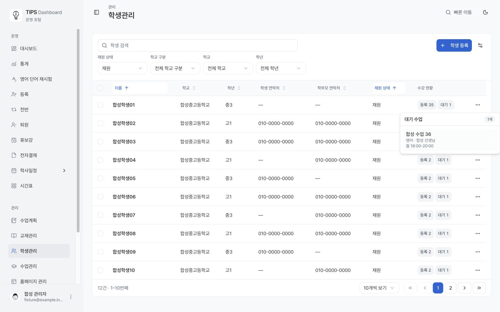
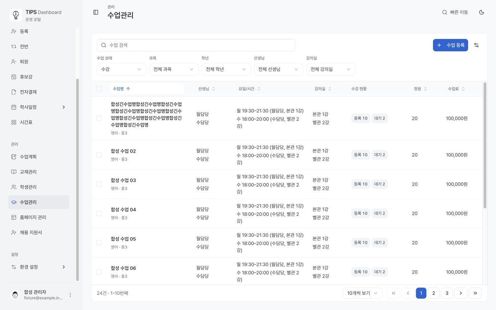
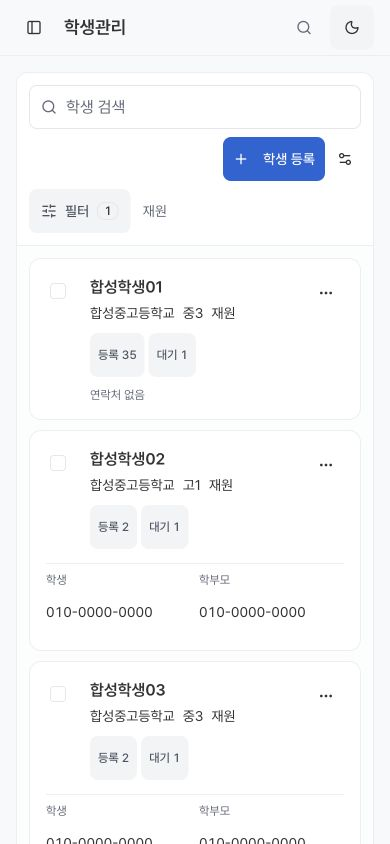
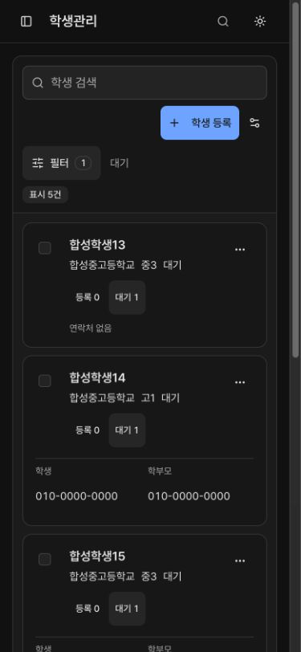

# 학생관리 수강 기반 재원 상태 검증

학생관리 기본 필터를 재원으로 변경하고 전체 상태 선택을 제거했다. 상태는 등록 수업이 있으면 재원, 등록 없이 대기 수업만 있으면 대기, 둘 다 없으면 퇴원이다. 표와 모바일 카드의 수강 현황은 등록·대기 수를 각각 표시한다.

## 구현 범위

- 번호·커서 목록, 집계, 필터 선택지, 상세, 상세 관계 페이지가 같은 정규화된 수업 관계를 사용한다. 학생/수업 양방향 배열과 확정 등록 이력을 수업별로 중복 제거하고, 같은 수업에서는 등록을 우선한다. 계획 상태의 정원 점유는 등록으로 세지 않는다.
- 목록의 수는 서버 전체 집계다. 클릭한 학생의 수업 상세만 30개씩 조회하며 더 불러오기, 실패 재시도, Escape 닫기와 포커스 복귀를 제공한다.
- 기존 저장 상태는 `storedStatus`로 보존하고 관리 화면의 표시 상태와 분리했다. 기존 퇴원 업무, RLS, invoker 권한, 함수 소유자/ACL은 유지했다. 수동 상태 선택과 학생 일괄 상태 변경은 제거했다.
- 수업관리와 `EnrollmentStatusTrigger`를 공유한다. 기존 표 설정의 열 순서·너비·숨김을 유지하고, 신규 열만 재원 상태 뒤에 삽입한다. 기본 상태 열은 제목이 읽히는 120px이며 기존 사용자 너비는 유지한다.

## 자동 검증

| 범위 | 결과 |
| --- | --- |
| 관리 React·서비스·상태 테스트 | 316개 통과 |
| 최종 모바일 필터 변경 후 관련 재검증 | 57개 통과 |
| 공통 대시보드 디자인 계약 | 63개 통과 |
| TypeScript / 변경 파일 ESLint / Next webpack build | 통과 |
| 격리 DB 기준 복원 검사 | 1,937개 통과 |
| 최종 migration 체인 기능 pgTAP | 216개 통과 |
| 변경 관리 함수 DB lint / Squawk / migration layout | 오류 없음 |
| 실제 격리 SQL DTO → 운영용 번호 목록 파서 | 6명, 세 상태와 35개 수업 수 검증 통과 |

SQL 검증에는 두 방향의 중복 관계, 등록·대기 동시 존재, 삭제된 수업 참조, 30개 이후 관계 페이지, 저장 상태와 실제 관계 불일치, RLS로 감춰진 학생·수업, anonymous 거부, 최종 함수의 SQLSTATE 22023, 입학 확정 전후 및 무발송 경계를 포함했다. 합성 학생 1,000명·수업 535개에서 authenticated 호출의 재원 필터 EXPLAIN ANALYZE는 348.75ms, shared hit 77,857이었다. 이는 로컬 합성 데이터 측정이며 운영 성능 측정은 아니다.

## 브라우저 검증

실제 Next 앱에 로컬 합성 API를 연결했다. 운영 개인정보·쓰기·발송은 사용하지 않았다. 데스크톱 1440×900와 모바일 390×844에서 확인했다.

- 기본 진입 재원, 선택지 재원/대기/퇴원만 노출, 초기화 시 재원 복귀.
- 대기는 등록 0·대기 1, 퇴원은 등록 0·대기 0 표시.
- 등록 35·대기 1인 학생의 대기 팝오버에서 30개 이후 마지막 대기 수업 도달.
- Escape 후 원래 수강 현황 버튼으로 포커스 복귀.
- 모바일 시트의 기본 요약은 재원이며 기본값에서는 초기화 버튼 비활성, 대기로 전환 후 초기화 시 재원 복귀.
- 수업관리의 동일 공통 버튼·표면·타이포그래피와 비교. 라이트/다크 확인, 브라우저 경고·오류 없음.

학생관리 데스크톱:

수업관리 기준 화면, 같은 데스크톱 크기와 라이트 테마:

학생관리 모바일 기본 재원:

학생관리 모바일 대기, 다크 테마:

## 배포 경계

이 기록은 구현·로컬 검증 증빙이다. 운영 DB migration 적용과 Production 배포는 아직 수행하지 않았다. 새 웹 클라이언트 배포 전에 `20260921144020_student_enrollment_status.sql` 적용이 필요하며, 이후 운영 목록·필터·상세를 읽기 전용으로 확인해야 한다.
