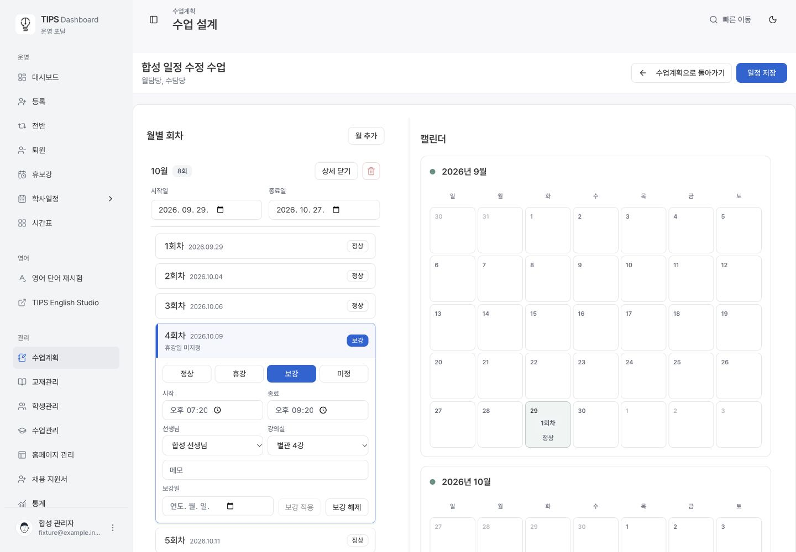
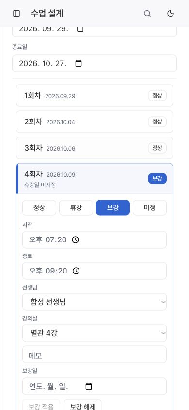
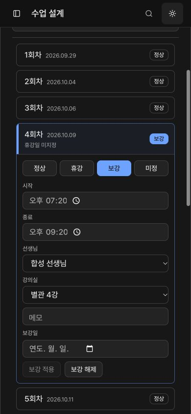

# Legacy lesson schedule save verification

Base: `fe7c26ab` (main). Local verification: 2026-09-29.

## Behavior

Legacy cancellations now remove only their dated weekly occupancy. Redundant session keys and billing metadata do not create new unresolved occupancy. The scheduling editor retains untouched billing-period rows, keeps explicit makeup times/resources on their dates, and requires those details for new makeup occupancy. Month counts include makeups and exclude cancellations; normalized exception overrides remain counted.

A synthetic October period starts with nine lessons. Cancelling two dates and adding one makeup saves eight lessons, with the last lesson renumbered from nine to eight. The original learning content is retained. Authentication, ACL, locking, idempotency, actual conflict rejection, and notification boundaries remain unchanged.

## Verification

- 69 focused Node tests passed (planner, schedule-only preservation, actual workspace, normalized exceptions, timetable conflicts).
- 53 common-control, contrast, and migration-boundary checks passed.
- 15 PostgreSQL regression files / 724 assertions passed against the final functions; the expanded legacy content test has 22 assertions including exact `23P01` failures and zero notification increases.
- Three additional isolated-DB assertions passed with a sanitized 78-session shape: no-op save, edited save, and eight counted October lessons. Live operational records were read only.
- ESLint, TypeScript, migration layout, domain SQLSTATE contract and Squawk 2.63.0 passed.
- Browser: actual Next.js workspace with an isolated synthetic API; missing-details feedback, real keyboard entry, save, reload, readback, and no-op save verified. DB RPC behavior was tested separately in isolated PostgreSQL.
- Design reference: this screen's normalized session editor; existing shared Input/NativeSelect, semantic tokens, no new shared visual rule. Desktop 1440 px, mobile 390 px, light/dark checked.

## Synthetic browser evidence

Deployment is verified separately after merge. No production class schedule edit or notification send is part of this release.
