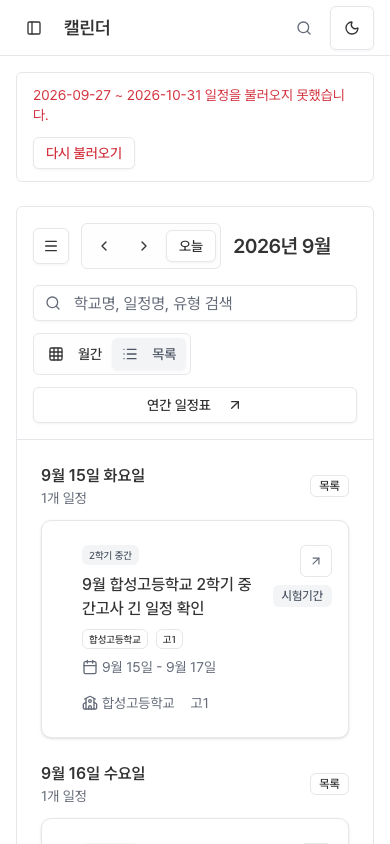
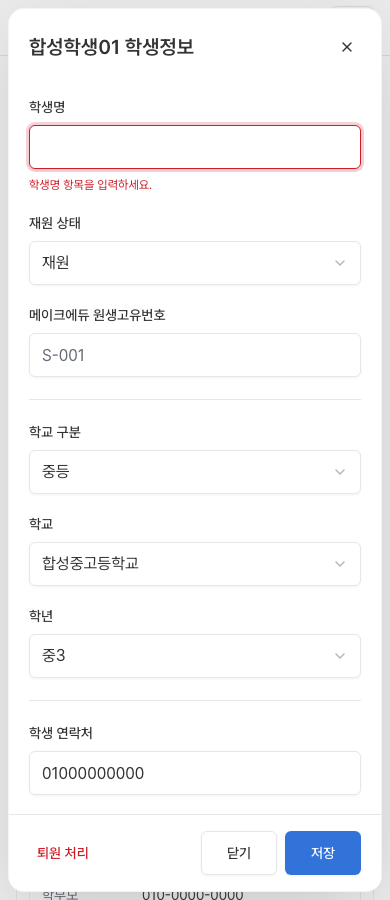
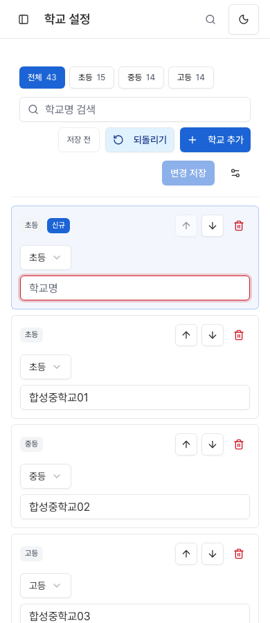
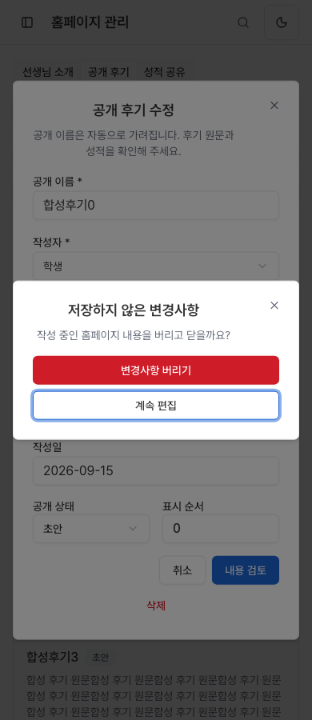

# 메뉴별 UX 정밀 리뷰와 개선 — 2026-09-15

기존 고도화 결과 `fd1f52ae` 이후 각 메뉴 내부의 조회·검색·상세·입력·취소·실패 복구를 검토했다. 확인된 불편을 고쳤으며 정상 동작에는 불필요한 변경을 하지 않았다. **로컬 구현·검증 기록이다. 운영 반영이나 모든 업무 상태 조합의 완전 검증을 뜻하지 않는다.**

## 이번에 달라진 행동

| 위치 | 이전 | 개선 |
| --- | --- | --- |
| 대시보드 | 건수가 단순 숫자로 표시됨 | 레벨테스트·방문상담·청강 건수에서 해당 등록 달력으로 바로 이동 |
| 통계 | 펼친 명단을 접을 수 없고 트리거가 사라짐 | 같은 버튼으로 펼침/접기, 포커스 유지, 받은 명단 재사용. 수업 그룹 내부의 학생 명단도 유지 |
| 통계 오류 | 명단의 페이지·상태 표현이 불명확 | 실패한 다음 페이지만 재시도, 기존 행 유지, 학생/수업 단위 구분, 빈 명단 설명, 쿼리·사용자 전환 시 이전 명단 분리 |
| 모바일 탭 | 링크로 선택된 탭이 가로 스크롤 밖에 남음 | 탭 줄 안에서 선택 탭만 보이도록 이동. 페이지 위치·포커스 유지 |
| 학생·수업 | 상세 이름을 공백으로 지워도 저장 요청 시작 | 필수값을 입력란에서 검증, 요청 전 차단, 해당 칸에 오류와 포커스 표시 |
| 전반·퇴원·단어 재시험·업무 | 추가 창을 닫으면 원래 버튼을 잃음 | 추가 창 진입 전에 호출 버튼을 기억하고 닫을 때 복귀 |
| 업무 검색 | 검색 0건에서 초기화할 때 입력란이 잠시 없어짐 | 0건·재조회 중에도 입력란과 포커스 유지 |
| 학교 설정 | 검색 중 추가한 새 학교가 결과에서 숨음 | 검색을 해제하고 새 행을 맨 위에 표시·포커스. 검색 초기화도 입력란으로 복귀 |
| 홈페이지 관리 | 수정 중 Escape로 작성 내용이 즉시 사라짐 | 기존 초안 보호 확인창으로 계속 편집/변경사항 버리기 선택. 깨끗한 창은 즉시 닫힘 |
| 학사 캘린더 | 목록 일정이 마우스로만 열림, 월 조회 실패 시 제목과 남은 일정이 다름 | 네이티브 상세 버튼과 포커스 복귀, 마지막 성공 범위 유지·실패 범위 재시도·늦은 응답 배제 |

## 메뉴별 실제 검토 범위

‘유지’는 실행한 범위에서 추가 결함을 확정하지 않았다는 뜻이다. 저장 성공·정산·승인·발송 같은 운영 데이터 변경은 수행하지 않았다.

| 메뉴 | 이번 실제 확인 | 조치 |
| --- | --- | --- |
| 대시보드 | 정상/빈 건수, 3종 건수 링크→정확한 달력 종류, PC·390px | 바로가기와 선택 탭 가시성 개선 |
| 통계 | 학생/수업/교재 탭, 학교 50개, 0건·필터·기간·조회 실패, 명단 접기·재시도·중첩 명단 | 동작 개선 및 요청 횟수 검증 |
| 등록 | 비어 있지 않은 단계 탭, 검색 0/복구, 목록/달력, 신청 상세·신규 창 진입/취소 | 검색 초기화 포커스 개선 |
| 전반 | 기간 선택, 과목→교사→수업→학생→다음 수업, 날짜 선택, 작성 후 계속/버리기 | 추가 창 닫기 포커스 개선 |
| 퇴원 | 기간 선택, 연결 항목·퇴원 날짜, 작성 후 계속/버리기 | 추가 창 닫기 포커스 개선 |
| 단어 재시험 | 비어 있지 않은 목록, 검색·기간·분원·역할 탭, 수동 등록/닫기 | 검색·추가 창 포커스 개선 |
| 업무 | 검색 0→지연된 복구, 새 업무 창·닫기 | 입력란 유지·포커스 개선 |
| 휴보강 | 신청 폼, 사유 수정→Escape 초안 확인 | 기존 보호 유지 |
| 전자결재 | 결재함/진행/완료/반려/내 문서, 빈 목록과 자유 양식 작성 화면 | 기존 동작 유지. 실제 결재 상세/처리는 미검증 |
| 학사 캘린더 | 월/목록, 검색, 상세 키보드 진입, 다음 달 실패·재시도·역순 응답·7일 범위 | 조회 범위와 복구·접근성 개선 |
| 학교 연간 일정표 | 비어 있지 않은 날짜 셀→상세/수정, 학교 구분·학기 필터 | 기존 동작 유지 |
| 시간표 | 교사/강의실/일별 보기, 긴 수업명, 상태 필터, 모바일 내부 스크롤 | 유지. 합성 그룹 관계 때문에 초기화 결과는 판정 유보 |
| 수업계획 | 2개 수업 목록·카드, 검색 0건/복구, 수업 설계 진입 | 기존 동작 유지 |
| 수업 설계 | 13회차, 교재와 저장 범위, 회차 진도 입력창→취소 | 기존 동작 유지. 적용/저장 성공은 미검증 |
| 수업일정 | 목록에서 실제 수업 설계 경로로 이동 | 기존 동작 유지 |
| 학생관리 | 긴 수업 이력, 이름 공백 저장 차단, 정상 입력의 합성 저장 실패, 초안 계속/버리기 | 필수값 검증 개선 |
| 수업관리 | 60자 수업명, 복수 교사·요일·강의실, 학생 명단/이동 취소, 이름 검증·초안 보호 | 필수값 검증 개선 |
| 교재 재고 | 목록, 검색 0/복구, 신규 등록 폼·취소 | 기존 동작 유지 |
| 교재 요청 | 학생용/교사용 수량, 검색 0/복구, 연결 자료가 있는 실제 수정창·닫기 | 기존 동작 유지 |
| 주문·입고 | 주문 10/입고 4/남음 6, 검색 복구, 주문 수정창·닫기 | 기존 동작 유지 |
| 교재 출고 | 수량·금액, 검색 복구, 출고 상세·닫기 | 기존 동작 유지 |
| 재고 실사 | 장부 7→입력 5→차이 -2, 요청이 발생하지 않는 로컬 입력 | 기존 동작 유지 |
| 학교 설정 | 42개 학교 검색·추가·입력·되돌리기, PC/모바일 | 새 행 가시성·포커스 개선 |
| 과목 설정 | 3과목, 토글 변경·합성 저장 실패에서 입력 유지 | 기존 동작 유지 |
| 선생님 설정 | 18명, 과목별 필터와 계정 입력 배치 | 기존 동작 유지. 계정 권한 변경은 미검증 |
| 강의실 설정 | 42개, 필터 0건→새 행, 변경→합성 저장 실패 | 기존 동작 유지 |
| 수업 그룹 설정 | 42개, 변경→합성 저장 실패와 초안 보존 | 기존 동작 유지 |
| 교재 설정 | 출판사/총판/세부과목, 출판사 0건 검색·복구 | 기존 동작 유지 |
| 알림 설정 | 실제 그룹→템플릿 편집·필수 변수 검증·초안 보호, 고객 알림 OFF | 기존 동작 유지. 발송·연결 활성화 없음 |
| 홈페이지 관리 | 선생님/후기/성적 탭, 후기 수정·Escape·계속/버리기·다시 열기 | 초안 보호 개선 |
| 채용 지원서 | 24개, 긴 지원 내용, 삭제 확인→취소·상세 닫기 | 기존 동작 유지. 실제 삭제 없음 |

## 검증 근거와 한계

브라우저는 로컬 Next 앱에 합성 인증·API 응답을 연결하여 실행했다. 알려지지 않은 API 및 외부 통신은 차단했다. PC 1440px와 모바일 390px의 현재 실행 화면을 직접 확인했다. 일부 학사 메뉴는 한쪽 화면의 상세 흐름만 실행했고, 그 구분은 학사 감사 보고서에 남겼다. 가상 모바일 크기 검증이며 실제 휴대폰·운영 DB 검증은 아니다.

통계에서 한 번 받아온 명단은 접기/다시 열기에 추가 요청이 발생하지 않음을 확인했다. 전체 초기 로딩 속도, 실제 사용자 p95, LCP/INP 개선율을 측정한 것은 아니므로 전체 성능 향상 수치는 주장하지 않는다.

- [운영 메뉴 상세 단계와 미검증 분기](task-2-report.md)
- [학사 메뉴 감사](task-3-audit.md)
- [캘린더 수정·검증](task-3-report.md)
- [설정·홈페이지·지원서·결재·휴보강 감사](task-4-audit.md)
- [공통·통계·관리 독립 검토](root-review.md)
- [운영 메뉴 독립 검토](task-2-review.md)
- [설정 수정 독립 검토](task-4-review.md)

검증 중 부정확한 초기 fixture, 잘못된 브라우저 선택자, 개발 서버 첫 컴파일 지연은 제품 결함이나 통과 증거로 채택하지 않았다. 교재의 초기 미정의 참조 API를 정식 consumer 계약에 맞춘 후 최종 다섯 탭×두 화면에서 미정의 요청/실행 오류 없이 다시 확인했다.

## 완료 검증

- 최종 제품 수정: `bae83ea9`. 해당 코드를 포함한 `8978c22f`에서 Next 운영용 빌드·TypeScript 통과.
- 변경된 소스/테스트 ESLint 통과. 대용량 기존 업무 파일의 Babel 안내 로그는 오류·경고가 아니다.
- 관련 검사: 운영 225개, 캘린더 52개, 그 외 관련 검사 168개 통과. 그 외 검사의 첫 실행에서 기존 소스 문자열 검증 1개가 달라진 표현을 가정해 실패하여, 실제 mounted 요청 헤더 검증으로 옮기고 해당 11개 검사를 다시 통과시켰다.
- 운영용 로컬 서버에서 대시보드·통계·학생·수업·학교·홈페이지 흐름을 1440/390px로 재검증. 마지막 캘린더 수정 후 재빌드하여 월/목록/오류/재시도/역순 응답/7일 복구를 양쪽 크기에서 다시 통과했고, 상세 실패→새 일정→닫기·상세 재시도→원래 버튼 복귀도 실제 PC 브라우저에서 통과했다.
- 공통·운영·설정·캘린더 및 전체 변경 독립 검토 승인. 발견된 중첩 명단 초기화와 캘린더 포커스 수명 문제를 수정 후 재검토했다.
- 빌드는 합성 Supabase 호스트로 실행했다. 공개 자료 조회 fallback 로그가 있으며 실제 공개 API 상태나 운영 DB를 확인한 빌드는 아니다.
- [최종 독립 검토](final-review.md) · [검증 기준과 빌드 식별자](verification.json)

작업은 로컬 브랜치와 기존 worktree에 보존했다. 실제 모바일 기기, 운영 계정, 운영 데이터 저장·승인·발송, 전체 Core Web Vitals 성능 측정은 별도 검증 범위다.

## 화면 증거

## 릴리스 경계

작업 브랜치 `codex/internal-dashboard-only-20260915`의 로컬 변경이다. `main` 푸시·병합·Vercel 운영 배포는 하지 않았다. 공개 화면은 계속 `tips_dashboard_public` 소유이고, 대시보드의 내부 CMS·데이터 API 계약은 유지한다.
