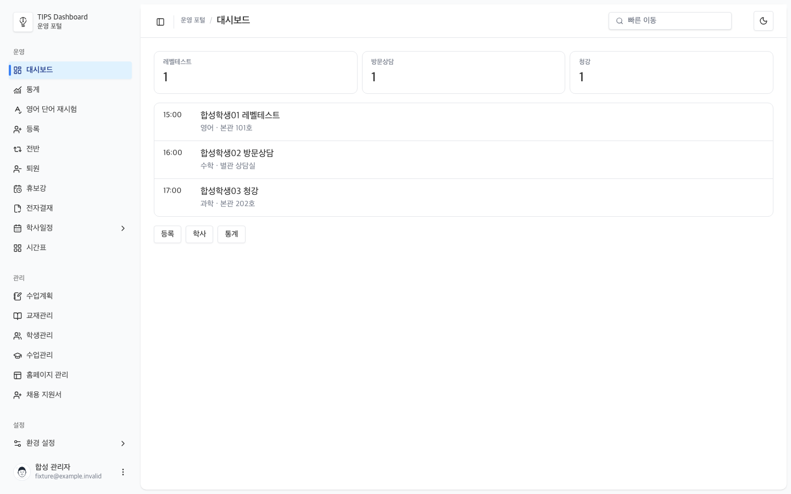
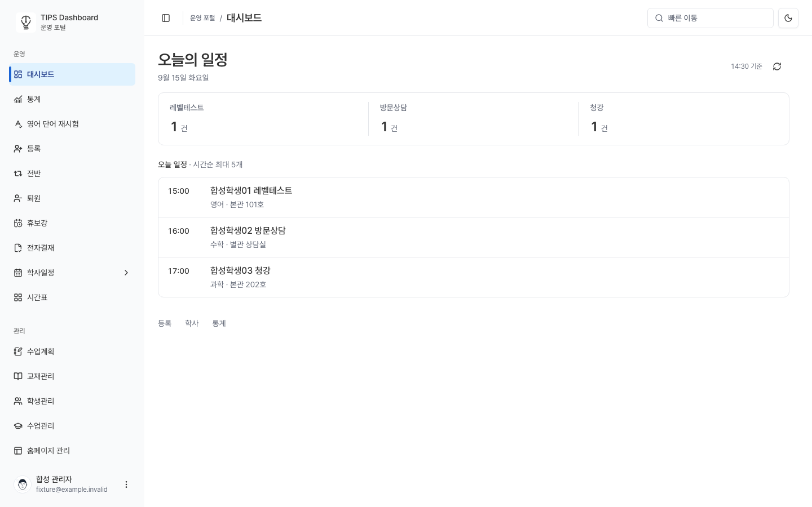
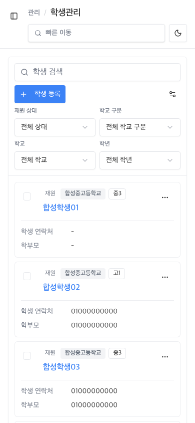
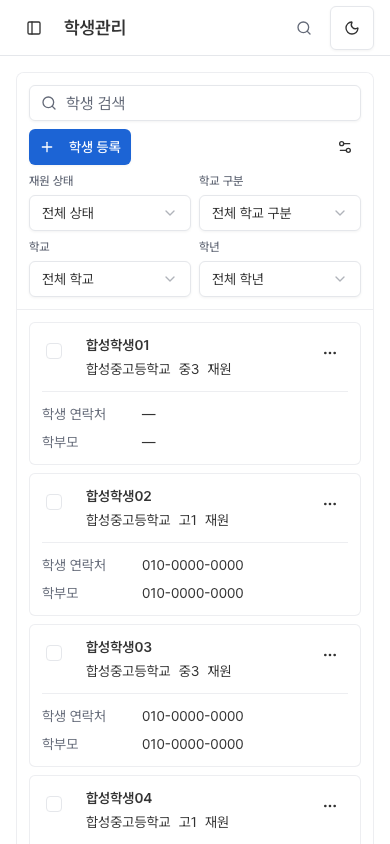

# TIPS Dashboard — 전체 고도화 로컬 검토 패키지

2026-09-15. **계획의 내부 UI/UX 구현과 자동·로컬 검증을 완료했다. 운영 배포는 하지 않았다.** 실제 사용자 평가와 실기기·운영 성능은 미측정이다. ‘어워즈 수준’은 목표 품질이며 자동 검사로 인증하는 등급이 아니다.

## 바뀐 경험

- 오늘의 일정: 날짜와 실제 갱신시각, 종류별 건수, 시간순 행과 다음 이동이 명확하다. 같은 사용자/역할/날짜의 갱신 실패에는 마지막 수락 데이터를 유지하고, 다른 조회의 오래된 응답은 노출하지 않는다.
- 전체 외곽과 제어: 헤더·사이드바·간격·표·입력·버튼을 공통 규칙으로 정렬했다. light/dark 주색·위험색 대비를 보완하고 공식 Pretendard를 자체 호스팅한다.
- 학생·수업: 이름 중심 목록, 연락처 표시, 긴 수업명과 요일별 시간/담당/장소를 보존했다. 상세의 넓은 작업 영역과 연결 정보, 저장 실패·닫기 취소 시 초안 보호를 유지한다.
- 등록: 여러 과목의 상태·책임자·일정이 대응하는 줄에 배치된다. 실제 상세7단계 탐색은 입력 화면을 닫거나 재생성하지 않는다. 짧은 모바일 viewport에서는 고정 헤더가 저장을 가리지 않는다.
- 교재: 모바일 분류 필터를 적용/취소 가능한 창으로 모으고 다섯 탭의 실제 수량·단위를 분명히 했다. 재고/입고/출고/반품 계산은 변경하지 않는다.
- 수업일정·통계: 조회하지 못한 진도를 가짜0%로 표시하지 않는다. 통계의 숫자·단위·정렬·drilldown과 URL/뒤로 가기 복원을 보완했다.
- 기타 경로: 공통 여백을 맞추고 휴보강 창을 닫을 때 키보드 포커스가 복원되도록 수정했다. 기존 적합한 업무 화면은 재구현하지 않고 검증했다.

사용자 선택대로 공개 UI와 커스텀 단축키는 제거했으며 내부 홈페이지 CMS·공개 데이터 API·캐시 갱신은 유지한다. 표준 Tab/Enter/Escape/화살표 접근성은 유지한다. 신규 통합 검색 API와 실제 어워즈 출품은 구현 범위에 포함하지 않았다.

## 검증 요약

- 관련 통합 테스트 **752/752 통과**.
- TypeScript·배포용 Next 빌드 통과. 변경 파일 lint 오류0, 기존 시간표 dependency 경고1 유지.
- 활성27개 경로의 PC1440/모바일390 실제 브라우저 증거를 해당 카드별로 확보했다. 공유 shell은320–1440의6너비×light/dark 검사 통과. 경로 렌더 통과가 모든 역할·저장 전이의 전수검증을 뜻하지 않는다.
- 독립 리뷰의 확정 미해결 결함0. 실제 검수에서 발견한 통계 접근성 이름, 등록 저장 가림, 휴보강 포커스 결함은 수정·재검증했다.
- 상태/필터/초안/상세·색/폰트·성능의 정확한 표본과 한계: [통합 검증 기록](T22.md). 설정의 비활성 알림 상태와 조회 제약은 [설정 검수](T20-settings.md).

## 전후 화면

같은 합성 데이터·크기로 비교한다. Before는 공개 UI/단축키 정리가 끝난 `5e423390` 빌드, After는 고도화된 `1d231495` 빌드다.

대시보드1440px — 이전:

대시보드1440px — 이후:

학생390px — 이전:

학생390px — 이후:

다른 실제 상세·등록·교재·통계 캡처는 T11–T20 문서의 로컬 artifact 경로에 보존했다. 원본 검수 artifact 기준 폴더는 `/tmp/tips-premium-dashboard-20260915/`다.

## 변경과 복구 경계

- 작업 브랜치: `codex/internal-dashboard-only-20260915`.
- 작업 폴더: `/Users/hyunjun/Documents/Codex/tips_dashboard/.worktrees/internal-dashboard-only-20260915`.
- 원격 기준: `2d89fcb2`; 내부 전용 정리: `5e423390`; 검증된 빌드: `1d231495`. 후속 커밋은 QA script·문서다.
- 기존 루트 checkout과 별도 공개 프로젝트는 변경하지 않았다. 작업 브랜치/체크아웃은 검토를 위해 보존한다.
- 이 변경의 API route·Supabase migration·package/lock diff는0이다. auth/RLS/ACL·RPC 계약·provider 발송·DB 계산을 디자인 목적으로 변경하지 않았다. UI hook의 수락 데이터/조회 경계 보완은 포함한다.
- 미배포 상태이므로 운영 rollback은 필요하지 않다. 특정 UI 회귀는 해당 카드 커밋과 의존 커밋을 검토해 revert할 수 있다. 고도화 전체를 되돌리는 기준은 cleanup `5e423390`이며 실제 revert 전에 후속 변경과 충돌을 확인한다. 사용자 변경을 덮는 reset은 하지 않는다.

## 남은 실환경 확인

직원5명의 대표 업무 시간/실수 비교, 실기기 키보드·터치, 화면읽기 도구/확대 전수검사, 실제 역할·데이터의 저장/실패 복구, 운영 Core Web Vitals는 아직 확인하지 않았다. 이 항목은 코드 미구현과 구분하며 성과 개선률을 임의로 쓰지 않는다.

배포 승인 후에는 PR/main CI, 배포 source SHA/READY/alias, 로그인 운영 읽기 검수를 이어서 수행해야 한다. 고객 발송이나 운영 데이터 변경을 이번 로컬 QA의 결과로 간주하지 않는다.
