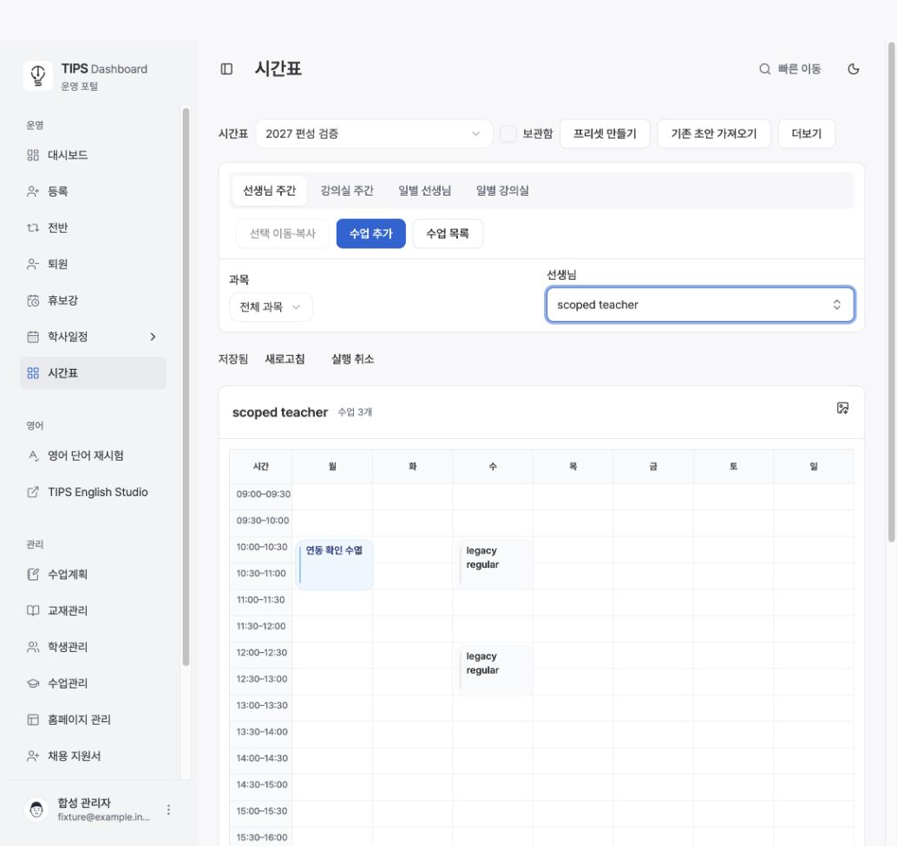
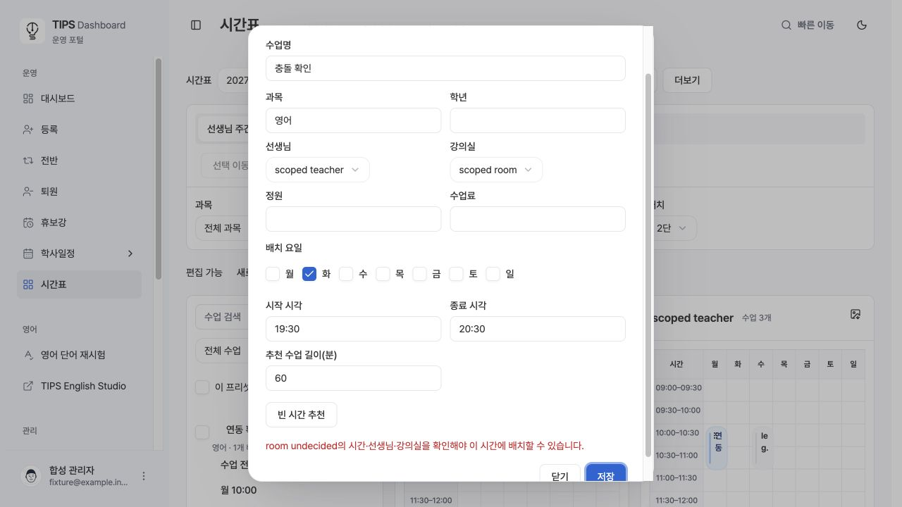
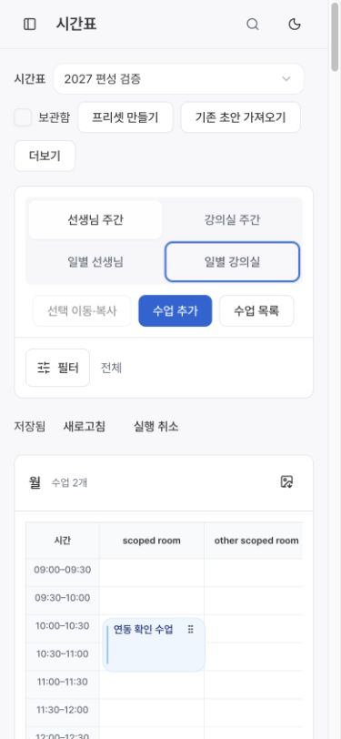

# 기존 수업을 보존하는 프리셋 검증 범위 수정

기존 수업에 내부 자원 연결 UUID가 없거나 강의실이 미정이라는 이유로 전체 프리셋을 잠그던 문제를 수정한다. 원본 수업·슬롯·회차는 수정하지 않는다. 유일한 정확한 이름으로 연결 가능한 자원은 읽기에서만 해석한다. 확인 가능한 요일·시간을 blocker에 보존하여 관련 배치만 차단한다. 저장·추천·이동/복사 미리보기·운영 반영·운영 변경 검사가 같은 범위를 사용한다.

기존 일반 회차의 정규 일정 상속은 실제 기존 생성 코드의 명시적 형태에 한정한다. 과거·강제 편성·보강·직접 입력한 시간은 추측하지 않는다. normalized source ID를 생성하지 않고 별도 상속 출처를 사용한다.

독립 DB에 baseline 및 120개 마이그레이션을 순서대로 재실행했고 pgTAP 710개가 통과했다. 이전 최종 함수로 되돌린 트랜잭션에서는 같은 회귀 검사의 이름 연결·관련 없는 저장이 실패함을 재현했다. Node 179개 및 TypeScript/ESLint 통과. 원본 보존, 알림 0, 권한, 실제 충돌의 `23P01`을 확인했다. 6,400개 예전 회차 조회 241–266ms, 가입 트리거와 점유 검사 775ms.

로컬 실제 DB를 연결한 브라우저에서 프리셋 생성과 수업 저장, 네 보기 연동, 09:00–24:00 고정 범위, 새 탭에서 저장 복원을 확인했다. 미정 강의실이 있는 화요일 19:30은 해당 수업명을 안내하며 거절했고, 같은 날 21:30으로 수정하자 저장됐다. 390px에서 페이지 가로 넘침이 없었다. 화면 스타일은 기존 시간표와 Button/Dialog를 그대로 사용한다. 운영 배포 여부는 PR 및 배포 확인 기록을 별도로 따른다.

