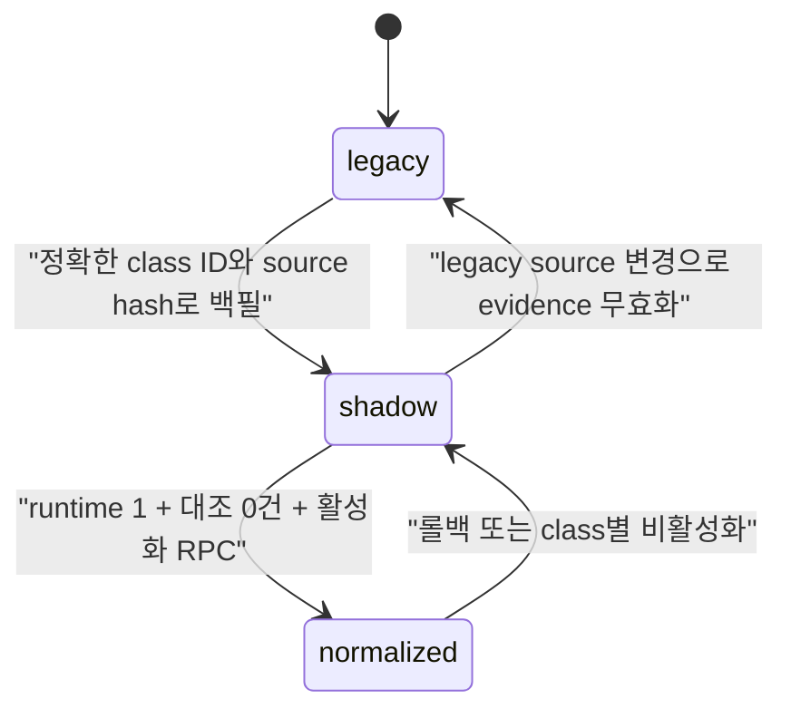

# 연속 수업 일정 모델 Release 2 상세 구현 계획

> **실행 방식 고정:** 이 계획의 구현·검토·테스트·배포는 주 에이전트가 현재
> 작업 안에서 직접, 한 태스크씩 순차 수행한다. 하위 에이전트, 병렬 에이전트,
> 별도 위임 작업은 사용하지 않는다. 사용자가 이후 명시적으로 이 제한을
> 해제하기 전까지 이 규칙을 Release 2 전체의 상위 제약으로 적용한다.

**목표:** 현재 기본 시간표를 정규화해 저장하고, 그 기본값으로 새 수업
일정을 만들며, 생성된 일정은 독립된 스냅샷으로 직접 수정할 수 있게 한다.

**아키텍처:** `class_schedule_slots`와 `class_lesson_sessions`를 전환된 수업의
권위 데이터로 사용한다. 기존 `classes.schedule_plan`은 호환 소비자를 위한
투영으로 같은 트랜잭션에서 유지하며, 기본 시간표 변경 경로에서는 기존 일정
행을 절대 갱신하지 않는다.

**기술 스택:** Next.js App Router, React, TypeScript/JavaScript, Supabase
Postgres, PostgREST RPC, RLS, pgTAP, Node test runner, ESLint, TypeScript,
Next.js Webpack build

**기준일:** 2026-07-29, Asia/Seoul

---

## 1. 상위 제약

1. 이 문서를 작성하는 현재 작업에서는 제품 코드, SQL 마이그레이션, 운영 DB,
   Git 브랜치, 배포 상태를 변경하지 않는다. 이 파일만 계획 산출물로 추가한다.
2. 구현 단계에서도 하위 에이전트와 병렬 에이전트를 사용하지 않는다. 주
   에이전트가 격리된 브랜치·worktree에서 태스크를 하나씩 직접 수행한다.
3. 기간별 두 번째 시간표와 `schedule_overrides` 계층을 만들지 않는다.
4. 기본 시간표 변경은 저장 이후 생성되는 일정에만 적용한다. 이미 생성된
   일정에는 일괄 적용·선택 적용·자동 동기화 기능을 만들지 않는다.
5. 기존 일정에 없는 과거 시간·선생님·강의실을 현재 기본값으로 추정하지
   않는다. 백필 값은 `null` 또는 빈 스냅샷을 유지한다.
6. `classes.schedule_plan`을 삭제하거나 의미를 재사용하지 않는다. Release 2
   호환 기간에는 정규화 mutation과 같은 트랜잭션에서 투영한다.
7. 운영 활성화 전까지 전역 runtime은 `0`, 수업별 권위는 `legacy`다.
   runtime `1` 변경은 별도 마이그레이션과 별도 배포 게이트를 통과한 뒤에만
   수행한다.
8. Google Chat, Web Push, SOLAPI, 알림 worker 또는 공급자 설정을 켜지
   않는다. 기존 휴보강 알림 source 생성 의미는 보존하되 실제 발송 활성화는
   이 릴리스 범위가 아니다.
9. 마이그레이션 파일의 타임스탬프를 계획서에서 임의로 정하지 않는다. 구현
   시 `supabase migration new <name>`으로 생성된 파일명을 그대로 사용한다.
10. 운영 데이터 mutation은 사용자 승인, 정확한 수업 ID, 예상 source hash,
    request key가 모두 있어야 한다. 암묵적인 전체 수업 쓰기 명령은 제공하지
    않는다.

---

## 2. 현재 상태 검토 결과

### 2.1 Git과 Release 1

- 현재 checkout은 `main`이며 `origin/main`과 동기화돼 있고 검토 시점
  worktree는 깨끗했다.
- Release 1 기준 마이그레이션은
  `supabase/migrations/20260728152442_continuous_class_schedule_foundation.sql`
  이다.
- Release 1은 additive/read-only 기반이다. mutation RPC, 운영 backfill,
  수업별 활성화, 기존 UI 저장 경로 변경은 포함하지 않았다.
- Release 1 검증 기록에는 focused 25건, 관련 114건, 전체 1,906건 테스트,
  ESLint, TypeScript, Webpack build와 운영 catalog 검사 33건 통과가 기록돼
  있다.

### 2.2 운영 DB에서 다시 확인한 사실

운영 Supabase 프로젝트 `tips dashboard`에서 읽기 전용으로 다음을
확인했다.

| 항목 | 현재 값 |
| --- | --- |
| 적용 마이그레이션 | `20260728152442_continuous_class_schedule_foundation` |
| `continuous_class_schedule_runtime_version()` | `0` |
| `classes` | 70행 |
| `schedule_storage_mode` | 70행 모두 `legacy` |
| `schedule_revision` | 70행 모두 `0` |
| `class_schedule_slots` | 0행 |
| `class_lesson_sessions` | 0행 |
| `class_schedule_mutation_receipts` | 0행 |
| 새 테이블 RLS | 활성 |
| 새 테이블 직접 쓰기 | `anon`, `authenticated` 모두 불가 |
| 새 테이블 읽기 | `authenticated` SELECT 정책 |
| audit/updated_at trigger | 활성 |

따라서 Release 2는 기존 shadow 데이터를 이어 쓰는 작업이 아니라, 비어 있는
정규화 기반 위에 write contract와 전환 절차를 처음 추가하는 작업이다.

### 2.3 현재 DB 계약

`class_schedule_slots`에는 요일, 시작·종료 시각, 선생님·강의실 카탈로그
참조와 표시명, 정렬 순서가 있다. `(class_id, weekday, start_time,
end_time)`가 고유하다.

`class_lesson_sessions`에는 안정 `session_key`, 원본 슬롯 FK, 날짜·상태,
시간·자원 스냅샷, origin, 보강 연결, 기존 billing 메타데이터, 메모,
일정별 `revision`이 있다. 기본 슬롯 FK는 `ON DELETE SET NULL`이다.

이 FK 때문에 기본 시간표 저장을 매번 전체 DELETE 후 INSERT로 구현하면
안 된다. 기존 슬롯은 입력 `id`를 기준으로 UPDATE하고, 새 슬롯만 INSERT하며,
명시적으로 제거된 슬롯만 DELETE하는 ID 보존 diff가 필요하다.

현재 `dashboard_audit_logs`에는 before/after와 actor가 있지만 request key,
operation, 정정 사유, 부모 class ID가 없다. 또한 `authenticated` 직접 INSERT
정책이 남아 있어 Release 2 audit의 신뢰 경계로 쓰기 전에 폐쇄해야 한다.

### 2.4 현재 애플리케이션 경로

#### 기본 시간표

- `/admin/classes`의
  `src/features/management/management-page.tsx`에 이미 요일·시작·종료·
  선생님·강의실 5열 편집기가 있다.
- 저장은 `src/features/management/management-service.js`의
  `updateClass()`를 거쳐 `classes.schedule`, `teacher`, `room` 등을 직접
  upsert한다.
- Release 2는 별도 중복 편집기를 만들지 않고 이 편집기의 저장 adapter와
  상태 모델을 바꾼다.

#### 일정 생성과 일정별 편집

- `/admin/class-schedule`, `/admin/curriculum?lessonDesign=1`,
  `/admin/curriculum/lesson-design`은 모두
  `src/features/operations/class-schedule-workspace.tsx`를 사용한다.
- 현재 “일정 생성”은 클라이언트에서 `schedule_plan` JSON을 만들고,
  `handleSaveLessonPlan()`이 `classes.schedule_plan` 전체를 직접 덮어쓴다.
- 현재 일정 상세는 상태·메모·보강일만 편집하며 시간·선생님·강의실
  스냅샷 편집은 없다.
- `src/features/operations/use-operations-workspace-data.ts`는 모든
  `classes`를 `select("*")`로 읽는다. 정규화 일정은 선택 수업과 날짜 범위만
  읽는 별도 hook으로 분리해야 한다.

#### 직접 writer와 소비자

- `src/app/api/makeup-requests/approve/route.ts`와
  `transition_makeup_request_v2`는 `schedule_plan_before/after` 전체 JSON을
  적용·원복한다.
- 등록 시작 회차 검증은 `schedule_plan.sessions`의 날짜·회차 라벨을
  사용한다.
- 대시보드 시험 충돌 계산은 `schedule_plan.sessions`의 날짜를 사용한다.
- 수업계획, 등록, 휴보강, 대시보드 외에도 업무 상세과 public class payload가
  `schedule_plan`을 읽는다.

전환 수업의 직접 JSON writer는 모두 제거하거나 mode-aware adapter로
바꾸기 전에는 수업별 `normalized` 활성화를 허용하지 않는다. 읽기 소비자는
정규화 reader로 전환하거나 호환 투영만으로 동일 결과가 나온다는 fixture를
통과해야 한다.

### 2.5 현재 runtime probe의 한계

`continuous-class-schedule-runtime-probe.ts`는 runtime 상태를 메모리에
캐시하지만 TTL이 없고 실제 UI call site가 없다. 롤백 직전에 `ready`를
캐시한 브라우저가 남을 수 있으므로 Release 2의 각 write RPC와 read RPC가
DB의 현재 runtime을 매 요청마다 재검증해야 한다. 클라이언트 probe는
라우팅 최적화일 뿐 보안·권위 판정 기준이 아니다.

---

## 3. Release 2 목표와 완료 조건

| 사용자 목표 | 완료 조건 |
| --- | --- |
| 기본 시간표 저장·수정 | 전환 수업에서 슬롯 ID를 보존하며 요일·시간·선생님·강의실을 RPC로 저장하고 class `schedule_revision`을 1회 증가 |
| 기본값으로 일정 생성 | 명시한 날짜 범위에서 결정적 session key로 새 행만 생성하고 슬롯 값을 스냅샷으로 복사 |
| 일정별 직접 수정 | 상태·날짜·시간·선생님·강의실·메모를 한 일정 단위 revision으로 저장 |
| 기존 일정 보호 | 기본 시간표 저장 전후 기존 `class_lesson_sessions` 전체 행 hash가 동일 |
| revision | 기본 시간표는 class revision, 일정은 session revision, 수업계획 content는 content hash로 stale write 거부 |
| idempotency | 동일 actor·operation·request key·본문은 원 응답 재반환, 같은 key의 다른 본문은 거부 |
| RLS/ACL | 직접 DML은 계속 불가, admin/staff만 명시적으로 허용된 RPC mutation 가능 |
| audit | row before/after, actor, class ID, request key, operation, 사유를 상관관계 조회 가능 |
| 롤백 | runtime `0` 복귀만으로 legacy JSON 읽기 경로가 즉시 권위가 되고 정규화 데이터는 보존 |
| 소비자 호환 | 수업계획·등록·휴보강·대시보드가 class mode에 맞는 권위 source를 사용하며 전환 전후 fixture 결과 동일 |

---

## 4. 범위

### 4.1 포함

- Release 1 스키마의 제약·audit·ACL 보강
- runtime marker를 private singleton 설정으로 전환
- 기본 시간표 조회·저장 RPC
- 일정 생성 preview·commit RPC
- 일정 한 건 조회·수정 RPC
- `schedule_plan` schedule-owned 필드의 트랜잭션 호환 투영
- 교재·진도 content만 안전하게 저장하는 normalized class adapter
- read-only preview를 실제 shadow backfill·검증·활성화 절차로 확장
- 등록 시작 일정 FK와 normalized 검증 경로
- 휴보강 승인·원복의 normalized session adapter
- 대시보드 일정 날짜의 mode-aware reader
- 수업관리와 수업계획 UI의 Release 2 기능
- canary 기반 수업별 전환, 전역 runtime 활성화, 운영 관찰, 비파괴 롤백

### 4.2 제외

- `class_textbook_assignments`와 교재 사용 구간 이력
- `progress_logs.lesson_session_id`와
  `progress_logs.textbook_assignment_id` FK 전환
- 종강·재개 전용 UI/RPC
- 수업별 전체 과거 이력 탐색 화면
- 수업관리·수업계획의 기간 필터 제거
- `class_terms`, `classes.term_id`, `classes.period`, 수업 그룹 삭제
- 수업료·급여·정산 규칙 변경
- 출결 기능
- 기간별 시간표, 예외 규칙 계층, 기존 일정 일괄 재적용
- `classes.schedule_plan` 삭제
- 알림 공급자 활성화 또는 실제 발송 범위 확대

위 항목은 Release 3 또는 별도 제품 결정으로 남긴다.

---

## 5. 접근안 비교와 선택

### A. 정규화 권위 + 트랜잭션 호환 투영 — 채택

전환된 수업의 기본값과 일정은 정규화 테이블이 권위 데이터다. 모든 mutation
RPC가 정규화 행과 `schedule_plan` 호환 표현을 한 트랜잭션에서 갱신한다.
기존 소비자가 전환되는 동안 JSON 롤백 경로를 보존할 수 있고, 기본값과 기존
일정의 책임을 분리할 수 있다.

### B. 클라이언트 dual write — 미채택

브라우저에서 정규화 테이블 저장 후 JSON을 별도로 저장하면 중간 실패,
네트워크 재시도, 탭 간 동시 수정에서 두 source가 쉽게 달라진다. DB
트랜잭션과 idempotency를 보장할 수 없어 채택하지 않는다.

### C. JSON 권위 유지 + 정규화 shadow write — 미채택

Release 1 상태를 연장하면 기존 전체 JSON 덮어쓰기와 일정별 충돌 문제가
남는다. 시간·선생님·강의실 스냅샷도 최종 권위가 되지 못하므로 Release 2
목표를 충족하지 않는다.

---

## 6. 권위 상태 모델



권위 판정은 다음 식 하나로 고정한다.

```text
normalized authority = runtime_version == 1
                       AND classes.schedule_storage_mode == 'normalized'
```

- `runtime=0`: 모든 수업은 JSON이 권위다. mode가 `normalized`로 남아 있어도
  read RPC는 legacy source를 반환한다.
- `runtime=1, mode=legacy|shadow`: JSON이 권위다.
- `runtime=1, mode=normalized`: 슬롯·일정이 권위이고 JSON은 투영이다.
- shadow 상태에서 legacy 일정 source가 바뀌면 trigger가 evidence를
  무효화하고 mode를 `legacy`로 되돌린다.
- runtime `0` 롤백 뒤 구버전 앱이 normalized 수업의 legacy 필드를 쓰면
  trigger는 쓰기를 허용하되 mode를 `shadow`로 내리고 재대조를 요구한다.
- runtime `1`의 normalized 수업에서 외부 직접 schedule write는 거부한다.

---

## 7. 핵심 불변식

### 7.1 기본 시간표

1. 슬롯 payload는 전체 현재 상태를 나타내며 기존 행은 자신의 `id`를 보낸다.
2. ID가 현재 수업 소유가 아니면 요청 전체를 거부한다.
3. 기존 ID는 UPDATE, 새 항목은 INSERT, payload에서 빠진 기존 ID만 DELETE한다.
4. 한 요청에서 실제 값이 바뀐 경우에만 class `schedule_revision`을 정확히
   1 증가시킨다. 의미상 동일한 저장은 no-op이다.
5. 이 함수는 `class_lesson_sessions`를 SELECT/UPDATE/DELETE하지 않는다.
   회귀 테스트에서는 저장 전후 일정 행 전체 JSON hash가 같아야 한다.
6. 카탈로그 ID가 입력되면 DB가 현재 표시명을 조회해 저장한다. 클라이언트가
   보낸 임의 표시명을 신뢰하지 않는다.
7. 기존 `classes.schedule`, `teacher`, `room`은 동일 트랜잭션에서 파생
   표시값으로 갱신한다.

### 7.2 일정 생성

1. 생성 범위는 시작일·종료일을 명시하고 최대 366일, 최대 후보 500건으로
   제한한다.
2. 기본 생성 key는
   `default:<source_slot_uuid>:<YYYY-MM-DD>`로 결정한다.
3. 같은 key 또는 기존 `(class_id, session_date, source_slot_id)`가 있으면
   `existing`으로 집계하고 어떤 필드도 덮어쓰지 않는다.
4. 새 행은 생성 순간 슬롯의 시간·선생님·강의실 ID와 표시명을 복사한다.
5. `origin='default'`, session `revision=0`으로 시작한다.
6. generation은 class row lock과 expected class revision으로 기본값 변경과
   직렬화한다. generation 자체는 class revision을 증가시키지 않는다.
7. 다른 수업의 교사·강의실 충돌은 기존 운영과 동일하게 진단 결과로
   반환하되 Release 2에서 새로운 강제 차단 규칙으로 만들지 않는다.
8. 새 일정의 legacy billing 메타데이터는 달력 월 기준의 결정적 ID·라벨·
   색상 fixture를 사용한다.

### 7.3 일정 직접 수정

1. class row를 먼저, session row를 다음 순서로 lock한다.
2. `expected_revision`이 다르면 SQLSTATE `40001`로 전체 요청을 거부한다.
3. 허용 필드는 상태, 날짜, 시작·종료 시각, 선생님, 강의실, memo,
   public note, teacher note뿐이다.
4. `source_schedule_slot_id`, `origin`, `session_key`,
   `makeup_of_session_id`는 일반 편집 RPC로 바꾸지 않는다.
5. `skipped`는 행 삭제가 아니라 상태값이다.
6. 저장 성공 시 해당 session revision만 1 증가한다. class schedule
   revision과 기본 슬롯은 바꾸지 않는다.
7. 종강 수업은 admin만 정정할 수 있고 사유가 필수다. 기본값 변경과 새
   일정 생성은 종강 수업에서 항상 거부한다.

### 7.4 호환 JSON

1. canonical session의 안정 키로 기존 `schedule_plan.sessions` 항목을
   찾고 schedule-owned 필드만 patch한다.
2. 교재 배정, `textbookEntries`, 계획·실제 진도, 알 수 없는 확장 필드는
   원래 JSON에서 그대로 보존한다.
3. 새 canonical session만 최소 호환 session object를 추가한다.
4. canonical에 없는 session object는 normalized mutation에서 제거하지
   않고 전환 issue로 처리한다.
5. `sessionStates` 같은 날짜 단일 key 구조는 같은 날짜 복수 일정의 권위가
   될 수 없다. normalized UI와 전환된 소비자는 session ID 기반 데이터를
   사용한다.
6. normalized 수업의 교재·진도 저장은 전체 `schedule_plan`을 받지 않고
   content 전용 typed patch만 받는다.

---

## 8. DB 마이그레이션 설계

모든 마이그레이션은 구현 시 Supabase CLI로 생성한다. 아래 이름은 suffix
계약이며 실제 타임스탬프는 CLI가 만든다.

### 8.1 Migration A — `continuous_class_schedule_release2_contracts`

#### 스키마 보강

- `dashboard_audit_logs`에 nullable 컬럼 추가:
  - `class_id uuid`
  - `request_key uuid`
  - `request_operation text`
  - `change_reason text`
- audit 조회 인덱스:
  - `(class_id, changed_at desc)`
  - `(request_key, changed_at)`
- `class_schedule_mutation_receipts.created_at` 인덱스 추가
- session key가 공백이 아니고 200자 이하인지 제약 추가
- cutover evidence용 private 테이블
  `dashboard_private.class_schedule_cutovers` 추가:
  - `class_id` PK
  - `source_schedule_plan_hash`
  - `projected_schedule_plan_hash`
  - `slot_count`, `session_count`
  - `issue_codes text[]`
  - `verified_at`, `verified_by`
  - `activated_at`, `activated_by`
  - `deactivated_at`, `deactivated_by`, `deactivation_reason`
- private runtime singleton 테이블
  `dashboard_private.continuous_class_schedule_runtime` 추가:
  - PK가 고정된 1행
  - `version` check `IN (0, 1)`
  - `changed_at`, `changed_by`, `change_reason`
- 기존 hardcoded runtime 함수가 singleton을 읽도록 교체하되 초기 version은
  계속 `0`이다.

#### audit hardening

- `dashboard_audit_logs_authenticated_insert` 정책 제거
- `PUBLIC`, `anon`, `authenticated`의 audit INSERT/UPDATE/DELETE 권한 revoke
- 기존 `public.log_dashboard_audit_event()`를 `search_path=''`와 schema
  qualification으로 보강
- trigger가 transaction-local request metadata를 읽어 새 컬럼에 기록
- 기존 teacher/profile/classes audit의 read 결과와 before/after 형식은 유지

#### 직접 write guard

`classes` BEFORE UPDATE trigger가 다음을 강제한다.

- 외부 직접 write는 `schedule_revision`, `schedule_storage_mode`, runtime
  관련 값을 바꿀 수 없다.
- runtime `1` + normalized에서 `schedule`, `teacher`, `room`,
  `schedule_plan`의 외부 변경을 거부한다.
- shadow에서 legacy source가 변경되면 mode를 legacy로 내리고 기존 cutover
  evidence를 stale로 표시한다.
- runtime `0`에서 normalized 수업의 legacy source가 외부 변경되면 mode를
  shadow로 내리고 evidence를 stale로 표시한다.
- RPC 내부 projection은 transaction-local guard를 설정한 경우에만 허용한다.

### 8.2 Migration B — `continuous_class_schedule_release2_mutations`

다음 private helper와 public RPC를 추가한다.

- canonical request hash와 advisory lock
- 인증·role·runtime·storage mode·종강 검증
- audit context 설정
- catalog ID 검증과 snapshot name 해석
- 슬롯 ID 보존 diff
- 일정 생성 후보 계산
- `schedule_plan` projection
- content-only merge와 content hash
- shadow backfill·검증·활성화·비활성화

Migration B 적용 후에도 runtime은 `0`이고 운영 UI는 legacy 권위를 유지한다.

### 8.3 Migration C — `continuous_class_schedule_release2_consumers`

- `ops_registration_enrollments`에 nullable
  `class_start_lesson_session_id uuid` FK 추가
- 기존 날짜·legacy session key·label은 호환 표시값으로 유지
- registration session 검증 helper와 관련 mutation 함수의 mode-aware 버전
  추가
- `makeup_requests`에 normalized 원 일정·보강 일정 참조를 저장할 nullable
  필드 추가
- private
  `dashboard_private.makeup_schedule_effect_receipts` 테이블 추가:
  - makeup request ID
  - class ID
  - request key
  - 적용 전/후 session row JSON
  - 적용 후 revision
  - applied/reverted actor와 시각
- `transition_makeup_request_v2`와 원복 helper가 class mode에 따라 legacy
  JSON 또는 canonical session path를 선택하도록 교체
- 기존 알림 source/event 생성과 idempotency ledger 계약은 유지

Migration C까지 적용해도 runtime은 계속 `0`이다.

### 8.4 Migration D — `continuous_class_schedule_release2_runtime_activate`

이 마이그레이션은 A~C 및 앱이 운영에 배포되고 모든 비활성 gate가 통과한
뒤 별도 commit으로 생성·적용한다.

- singleton runtime version을 `0 → 1`로 변경
- 이전 값이 0인지 guarded update
- 변경 actor·사유 기록
- 다른 schema/data mutation을 포함하지 않음

runtime `1`만으로 기존 수업이 자동 normalized가 되지는 않는다. 검증된
수업을 class별 activation RPC로 전환한다.

---

## 9. RPC 계약

공개 mutation 함수는 통제된 테이블 쓰기가 필요하므로
`SECURITY DEFINER`, owner `postgres`, `SET search_path=''`로 구현한다.
모든 object를 schema-qualified하고 함수 본문 첫 단계에서 `auth.uid()`와
`current_dashboard_role()`을 다시 확인한다. 기본값인 security invoker를
쓸 수 있는 read 함수는 invoker로 유지한다.

공개 함수는 기본 EXECUTE 권한을 모두 revoke한 뒤 필요한 함수만
`authenticated`에 명시적으로 grant한다. private helper는 `PUBLIC`, `anon`,
`authenticated`, `service_role`에 EXECUTE를 주지 않는다.

### 9.1 조회

```sql
public.get_class_schedule_defaults_v1(
  p_class_id uuid
) returns jsonb
```

반환:

- 현재 runtime version
- storage mode와 authoritative source
- class schedule revision
- 현재 기본 슬롯
- legacy 표시값
- closed 여부

```sql
public.get_class_schedule_v1(
  p_class_id uuid,
  p_date_from date,
  p_date_to date
) returns jsonb
```

반환:

- 위 class metadata
- 지정 범위의 session만 날짜·시간·안정 key 순으로 정렬
- 각 session revision과 snapshot
- content hash
- `hasMoreBefore`, `hasMoreAfter`

runtime `0` 또는 non-normalized 수업이면 canonical 행을 권위 데이터처럼
반환하지 않고 `authoritativeSource='legacy'`를 반환한다. 클라이언트는 기존
JSON adapter를 사용한다.

### 9.2 새 수업 초기화

```sql
public.initialize_new_class_schedule_v1(
  p_class_id uuid,
  p_expected_schedule_revision bigint,
  p_expected_schedule_plan_hash text,
  p_slots jsonb,
  p_request_key uuid
) returns jsonb
```

- runtime `1`, mode legacy, revision 0, canonical 행 0개인 수업만 허용
- legacy plan에 이미 일정이 있으면 거부하고 shadow backfill 절차를 요구
- 새 수업 생성 직후의 복구 가능한 두 번째 단계로 사용
- 슬롯 저장, 호환 projection, mode normalized를 한 트랜잭션에서 수행
- 실패하면 수업 행은 legacy로 남으므로 같은 request key로 안전하게 재시도

### 9.3 기본 시간표 저장

```sql
public.save_class_schedule_defaults_v1(
  p_class_id uuid,
  p_expected_schedule_revision bigint,
  p_slots jsonb,
  p_request_key uuid,
  p_reason text default null
) returns jsonb
```

슬롯 항목 계약:

```json
{
  "id": "기존 UUID 또는 null",
  "weekday": 0,
  "startTime": "14:00",
  "endTime": "15:30",
  "teacherCatalogId": "UUID 또는 null",
  "classroomCatalogId": "UUID 또는 null",
  "sortOrder": 0
}
```

검증:

- 최대 64개
- 알려지지 않은 key 거부
- weekday 0~6
- start < end
- 같은 수업의 동일 요일·동일 시간 중복 거부
- 기존 slot ID 소유권 확인
- 선택한 catalog가 존재하고 현재 수업 과목에 허용되는지 확인
- 과학 수업의 기존 필수 교사·강의실 규칙 유지
- normalized mode와 runtime `1`
- 종강 수업 거부

응답은 새 class revision, canonical slots, legacy 표시값, projection hash,
`changed`를 반환한다.

### 9.4 일정 생성 preview

```sql
public.preview_class_lesson_session_generation_v1(
  p_class_id uuid,
  p_expected_schedule_revision bigint,
  p_date_from date,
  p_date_to date
) returns jsonb
```

DB의 실제 후보 계산 helper를 읽기 전용으로 호출한다. 생성 RPC와 다른 JS
계산을 사용하지 않는다.

반환:

- `requestedCount`
- `creatableCount`
- `existingCount`
- `excludedCount`
- `resourceConflictCount`
- 후보별 날짜, 슬롯, 시간, resource conflict 요약

### 9.5 일정 생성 commit

```sql
public.generate_class_lesson_sessions_v1(
  p_class_id uuid,
  p_expected_schedule_revision bigint,
  p_date_from date,
  p_date_to date,
  p_request_key uuid,
  p_reason text default null
) returns jsonb
```

동일 helper를 class lock 뒤 다시 실행한다. 한 후보라도 payload·catalog·range
검증에 실패하면 전체 rollback한다. 기존 후보는 유지하고 새 행만 INSERT한다.
응답에는 생성 ID와 preview 집계가 포함된다.

### 9.6 일정 한 건 저장

```sql
public.save_class_lesson_session_v1(
  p_session_id uuid,
  p_expected_revision bigint,
  p_schedule_state text,
  p_session_date date,
  p_start_time time,
  p_end_time time,
  p_teacher_catalog_id uuid,
  p_classroom_catalog_id uuid,
  p_memo text,
  p_public_note text,
  p_teacher_note text,
  p_request_key uuid,
  p_correction_reason text default null
) returns jsonb
```

JSON patch 대신 명시적 전체값 계약을 사용한다. DB가 catalog name snapshot을
결정하고 해당 session만 revision 1 증가시킨다. normalized projection도 같은
session key만 patch한다.

### 9.7 수업계획 content 저장

```sql
public.save_class_lesson_content_v1(
  p_class_id uuid,
  p_expected_content_hash text,
  p_content_patch jsonb,
  p_request_key uuid
) returns jsonb
```

허용 payload는 top-level textbook 설정과
`{sessionKey, textbookEntries}` 배열뿐이다. 날짜·상태·시간·자원·session key,
billing 등 schedule-owned 필드가 들어오면 거부한다. DB가 현재 projection에
content를 merge하고 새 content hash를 반환한다.

### 9.8 전환 운영 RPC

```sql
public.backfill_class_schedule_shadow_v1(
  p_class_id uuid,
  p_expected_source_hash text,
  p_slots jsonb,
  p_sessions jsonb,
  p_request_key uuid
) returns jsonb
```

- admin만 허용
- mode legacy 또는 아직 활성화된 적 없는 shadow만 허용
- current `schedule_plan` hash 일치 확인
- legacy session의 시간·resource snapshot을 추정하지 않음
- upsert/diff 후 mode shadow
- source·projection hash, count, issue codes 기록

```sql
public.verify_class_schedule_shadow_v1(
  p_class_id uuid,
  p_expected_source_hash text
) returns jsonb
```

slot/session tuple, 원본 hash, projection exact equality, issue code를 다시
계산한다.

```sql
public.activate_class_schedule_storage_v1(
  p_class_id uuid,
  p_expected_schedule_revision bigint,
  p_expected_source_hash text,
  p_request_key uuid
) returns jsonb
```

- runtime `1` 필수
- mode shadow 필수
- critical issue 0, mismatch 0, exact projection equality 필수
- mode만 normalized로 변경하고 slot/session/revision은 바꾸지 않음

```sql
public.deactivate_class_schedule_storage_v1(
  p_class_id uuid,
  p_request_key uuid,
  p_reason text
) returns jsonb
```

- admin과 필수 사유
- normalized → shadow
- 정규화 행, receipt, audit를 삭제하지 않음

---

## 10. revision, idempotency, RLS, audit

### 10.1 revision

- 기본값: `classes.schedule_revision`
- 일정: `class_lesson_sessions.revision`
- 수업계획 content: schedule-owned 필드를 제외한 canonical JSON의 SHA-256
  `contentHash`
- stale write는 자동 merge하지 않고 `40001`로 거부한다.
- UI는 최신 데이터를 다시 읽고 사용자가 다시 저장하도록 한다.

### 10.2 idempotency

모든 mutation은 다음 순서를 공유한다.

1. actor, operation, request key로 transaction advisory lock
2. 의미 입력을 canonical jsonb로 정규화
3. operation, 대상 ID, expected revision/hash를 포함한 SHA-256 계산
4. receipt 조회
5. 같은 key·같은 hash면 revision 확인보다 먼저 저장된 응답 재반환
6. 같은 key·다른 hash면 `idempotency_key_reused`, SQLSTATE `22023`
7. 권위 행 lock과 검증
8. mutation·projection·audit 수행
9. 최종 응답 receipt 저장
10. commit

실패 트랜잭션에는 receipt가 남지 않는다. Release 2에서는 receipt를 자동
삭제하지 않고 `created_at` 인덱스만 추가한다.

### 10.3 역할과 RLS

| 역할 | 직접 slot/session SELECT | 직접 DML | user mutation RPC | cutover RPC |
| --- | --- | --- | --- | --- |
| anon | 불가 | 불가 | 불가 | 불가 |
| authenticated admin | 기존 호환 범위 | 불가 | 가능 | 가능 |
| authenticated staff | 기존 호환 범위 | 불가 | 가능 | 불가 |
| teacher/viewer/assistant | 기존 Release 1 read 범위 유지 | 불가 | 불가 | 불가 |
| service_role | 앱용 RPC EXECUTE 미부여 | 직접 사용 금지 | 사용 금지 | 사용 금지 |

Release 2는 기존 authenticated read 가시성을 넓히지 않으며, teacher별 수업
행 제한 정책은 실제 담당 수업 mapping을 별도로 확정한 뒤 후속 보안
릴리스에서 다룬다. mutation은 admin/staff로 축소한다.

Supabase의 table grant와 RLS는 서로 다른 경계이므로 둘 다 검사한다.
새 public 함수의 기본 EXECUTE도 명시적으로 revoke한다. 이 원칙은
[Supabase RLS 문서](https://supabase.com/docs/guides/database/postgres/row-level-security),
[API 보안 문서](https://supabase.com/docs/guides/api/securing-your-api),
[DB 함수 보안 지침](https://supabase.com/docs/guides/database/functions)에
맞춰 검증한다.

### 10.4 audit

각 RPC는 transaction-local context에 다음 값을 설정한다.

- actor profile ID/email/role
- request key
- operation
- class ID
- correction reason

slot/session/classes trigger는 같은 request key로 묶인 before/after를 기록한다.
no-op 저장은 receipt에는 남지만 row audit와 revision을 만들지 않는다.
종강 수업 정정은 reason이 비어 있으면 거부한다.

---

## 11. 호환 projection과 소비자 전환

### 11.1 schedule-owned 필드

- session ID/key
- 날짜와 정렬용 session number
- schedule state
- 시간
- 선생님·강의실 ID와 snapshot
- memo/public note/teacher note
- 보강 연결 메타데이터
- billing 호환 메타데이터

### 11.2 content-owned 필드

- top-level textbooks와 교재 표시 설정
- session별 `textbookEntries`
- 교재 계획 범위와 실제 진도 표시 데이터
- 일정 mutation과 무관한 알 수 없는 확장 필드

projection helper는 기존 session object를 안정 key로 찾아 schedule-owned
필드만 교체한다. content 저장 RPC는 반대로 content-owned 필드만 교체한다.

### 11.3 수업계획

- normalized 수업은 `get_class_schedule_v1`의 bounded session과 기존 content를
  합성해 화면 모델을 만든다.
- 상태·시간·resource 저장은 session RPC로 분리한다.
- 교재 계획 저장은 content RPC로 분리한다.
- direct `classes.schedule_plan` update를 제거한다.
- legacy/shadow 수업은 기존 경로를 유지한다.

### 11.4 등록

- `ops_registration_enrollments.class_start_lesson_session_id`를 장기 참조로
  사용한다.
- UI option은 lesson session ID를 숨은 값으로 갖고 날짜·계산된 회차 라벨을
  표시한다.
- normalized 수업은 class ID, session ID, 날짜, 허용 상태
  `active|makeup`을 DB에서 검증한다.
- 기존 날짜·legacy key·label은 표시와 롤백 호환을 위해 함께 기록한다.
- 기존 enrollment 백필은 class+날짜+legacy key가 정확히 한 session에
  일치할 때만 FK를 채운다. 0건 또는 복수 후보는 null과 issue로 남긴다.

### 11.5 휴보강

- 신청 단계에서 normalized 수업이면 취소 대상 session ID를 명시한다.
- 승인 단계에서 class mode를 다시 읽고, normalized이면 private canonical
  helper로 원 일정 상태 변경과 보강 일정 생성/수정을 수행한다.
- 적용 전/후 행과 revision을 private effect receipt에 보존한다.
- 승인 취소는 저장된 after revision이 현재와 일치할 때만 원복한다. 다른
  편집이 있으면 `40001`로 중지해 사용자의 후속 변경을 덮어쓰지 않는다.
- calendar event와 기존 notification source는 같은 트랜잭션 의미를 유지한다.
- legacy/shadow 수업은 기존 `schedule_plan_before/after` 경로를 유지한다.

### 11.6 대시보드와 나머지 reader

- 대시보드 시험 충돌은 필요한 class ID와 날짜 범위의 normalized session
  날짜만 읽는 adapter를 추가한다.
- 업무 상세·word retest·public payload처럼 투영으로 충분한 consumer는
  전환 전후 fixture가 동일할 때만 JSON 호환 reader에 남긴다.
- activation 전에 `rg` inventory를 다시 실행해 normalized 수업의 직접 writer
  0건과 미분류 reader 0건을 증거로 남긴다.

---

## 12. UI 변경 범위

### 12.1 `/admin/classes`

기존 5열 편집기를 재사용한다.

- normalized 수업 detail을 열 때 defaults RPC로 그 수업 슬롯만 조회
- select value를 이름이 아니라 catalog UUID로 변경
- 기존 슬롯 ID를 form state에 유지
- 기본 시간표 영역 안에 한 줄만 표시:
  `새로 생성하는 일정부터 적용 · 기존 일정은 유지`
- 기존 수업의 기본 시간표에는 별도 `기본 시간표 저장` action을 둬 일반
  class metadata 저장과 부분 성공을 섞지 않는다.
- stale revision이면 입력을 자동 덮지 않고 최신값 새로고침 action 표시
- legacy 수업은 기존 저장 경로 유지
- shadow 수업은 짧은 전환 시간 동안 legacy가 권위이며 source 변경 시
  자동으로 legacy mode가 된다는 운영 규칙 적용
- 새 수업은 기존 class 생성 성공 뒤 initialization RPC를 호출한다. 두 번째
  단계 실패 시 생성된 legacy 수업을 숨기지 않고 재시도 가능한 오류를 표시

추가 설명 카드, 기술적인 mode 배지, revision 숫자는 노출하지 않는다.

### 12.2 수업계획 공용 workspace

대상 경로:

- `/admin/class-schedule`
- `/admin/curriculum?lessonDesign=1`
- `/admin/curriculum/lesson-design`

변경:

- 선택 수업과 현재 보이는 월 범위만 normalized session 조회
- 월 이동 시 범위 fetch, 동일 범위 중복 요청 dedupe
- “일정 생성”은 시작일·종료일 입력 → preview → 확인의 두 단계
- 결과는 `추가 N · 기존 M · 확인 필요 K`로 짧게 표시
- 일정 상세에 날짜, 시작·종료, 선생님, 강의실, 상태, 메모 입력 추가
- 기존 `정상/휴강/보강/미정` 첫 클릭은 즉시 draft에 보이고, 명시적
  `일정 저장`으로 해당 한 건만 RPC commit
- `해제`는 삭제가 아니라 `skipped`
- legacy backfill 일정의 빈 snapshot은 `기록 없음`으로 표시
- session 저장과 교재·진도 저장 버튼과 오류 상태를 분리
- 다른 사용자의 변경은 409 안내 후 해당 session만 다시 읽기

### 12.3 접근성·회귀

- 모든 입력은 session label을 포함한 accessible name 제공
- keyboard로 날짜·시간·select·저장 action 접근 가능
- in-flight 중 중복 저장만 막고 읽기·다른 session 이동은 불필요하게 막지 않음
- 모바일에서는 기존 단일 열 상세 흐름 유지
- 첫 상태 클릭, clear/restore, dialog exit의 기존 회귀 계약 유지

---

## 13. 구현 태스크

각 태스크는 주 에이전트가 직접 수행하고, 실패 테스트 작성 → 최소 구현 →
focused 검증 → diff 검토 → commit 순서를 지킨다. 태스크 사이에 미완성
변경을 섞지 않는다.

### Task 0. 실행 격리와 기준선 고정

**파일**

- 참조:
  `docs/superpowers/specs/2026-07-28-continuous-classes-session-snapshots-design.md`
- 참조:
  `docs/superpowers/plans/2026-07-28-continuous-class-schedule-foundation.md`
- 생성:
  `docs/operations/continuous-class-schedule-release-2-runbook.md`
- 생성:
  `docs/operations/evidence/continuous-class-schedule-release-2-baseline.md`

**스텝**

1. `codex/continuous-schedule-release-2` 브랜치와 격리 worktree를 만든다.
2. 원 checkout, worktree, remote `main` 상태를 각각 기록한다.
3. Release 1 focused/full 검증을 재실행해 기준선이 여전히 통과하는지 확인한다.
4. 운영 DB의 runtime/mode/revision/count/ACL을 read-only query로 다시 캡처한다.
5. 모든 `schedule_plan` reader/writer 목록과 소비 필드를 evidence에 고정한다.
6. 알림 provider가 이 작업으로 활성화되지 않는다는 상태를 별도 기록한다.
7. 기준선이 다르면 구현을 시작하지 않고 원인을 먼저 해결한다.

**검증**

```bash
git status --short --branch
git rev-parse HEAD
git rev-parse origin/main
rg -l "schedule_plan|schedulePlan" src
```

**commit:** `docs: lock release 2 continuous schedule baseline`

### Task 1. 실패하는 DB contract와 fixture 작성

**파일**

- 생성: `tests/continuous-class-schedule-release2-schema.test.mjs`
- 생성: `supabase/tests/continuous_class_schedule_release2_test.sql`
- 생성: `tests/fixtures/continuous-class-schedule-release2-contract.json`

**스텝**

1. runtime 0, 신규 audit 컬럼, direct audit write 폐쇄를 검사한다.
2. public/private 함수 owner, security mode, 빈 search path, EXECUTE grant를
   검사한다.
3. anon/admin/staff/teacher role matrix를 작성한다.
4. direct slot/session DML 거부와 RPC-only mutation을 검사한다.
5. default 변경 전후 기존 session 전체 hash 동일 test를 먼저 실패시킨다.
6. stale revision, idempotent replay, key reuse, no-op revision을 먼저
   실패시킨다.
7. projection이 textbook/progress/unknown field를 보존하는 fixture를 만든다.
8. 같은 날짜 복수 session과 legacy 빈 snapshot fixture를 포함한다.

**검증**

```bash
node --test tests/continuous-class-schedule-release2-schema.test.mjs
```

예상 결과는 Migration A/B가 없으므로 실패다.

**commit:** `test: lock release 2 schedule database contracts`

### Task 2. Migration A — contract, runtime, audit, guard

**파일**

- 생성:
  `supabase/migrations/<generated>_continuous_class_schedule_release2_contracts.sql`
- 수정: `supabase/tests/continuous_class_schedule_release2_test.sql`
- 수정: `tests/continuous-class-schedule-release2-schema.test.mjs`

**스텝**

1. `supabase migration new continuous_class_schedule_release2_contracts` 실행
2. audit 컬럼·인덱스와 receipt 인덱스 추가
3. runtime singleton과 runtime read 함수 교체, 값 0 유지
4. cutover evidence table 추가, 모든 grant revoke
5. generic audit 함수를 empty search path로 harden
6. audit 직접 INSERT 정책과 grant 제거
7. classes direct schedule write guard 추가
8. constraint를 `NOT VALID`로 추가해야 하는 기존 데이터 항목은 사전
   read-only 검사 후 validate 단계 분리
9. pgTAP과 lexical test 통과

**검증**

```bash
node --test tests/continuous-class-schedule-release2-schema.test.mjs
```

별도 disposable DB에서 migration apply, pgTAP, rollback transaction을
검증한다. 운영 DB에는 이 태스크만으로 적용하지 않는다.

**commit:** `feat: harden continuous schedule release 2 contracts`

### Task 3. pure model과 TypeScript RPC contract

**파일**

- 수정: `src/features/academic/continuous-class-schedule-model.ts`
- 수정: `src/features/academic/continuous-class-schedule-service.ts`
- 생성: `src/features/academic/continuous-class-schedule-contract.ts`
- 생성: `tests/continuous-class-schedule-release2-model.node.ts`
- 생성: `tests/continuous-class-schedule-release2-service.test.mjs`

**스텝**

1. RPC input/output camelCase type을 한 파일에 고정한다.
2. slot ID diff model과 validation result type을 만든다.
3. generation candidate/session key/billing compatibility pure model을 만든다.
4. legacy shadow comparison에 시간·resource·memo·projection issue code를
   추가하되 legacy session 빈 snapshot 규칙은 유지한다.
5. Supabase error code를 stale/forbidden/not-ready/idempotency/validation으로
   매핑한다.
6. request key는 UI action 시작 시 1회 만들고 네트워크 재시도 동안 재사용한다.
7. source test가 수동 최소 타입과 실제 RPC 계약의 drift를 검출하게 한다.

**검증**

```bash
node --test --experimental-strip-types tests/continuous-class-schedule-release2-model.node.ts
node --test tests/continuous-class-schedule-release2-service.test.mjs
```

**commit:** `feat: define continuous schedule release 2 contracts`

### Task 4. Migration B — 기본값, 생성, 일정 수정, projection

**파일**

- 생성:
  `supabase/migrations/<generated>_continuous_class_schedule_release2_mutations.sql`
- 수정: `supabase/tests/continuous_class_schedule_release2_test.sql`
- 수정: `tests/continuous-class-schedule-release2-schema.test.mjs`

**스텝**

1. auth/role/runtime/mode/closed assertion helper 구현
2. canonical hash, advisory lock, receipt replay helper 구현
3. audit context helper 구현
4. catalog resolution helper 구현
5. content-preserving projection helper와 exact backfill projection 구현
6. defaults 조회·초기화·저장 RPC 구현
7. generation preview·commit RPC 구현
8. session 단건 저장 RPC 구현
9. content-only 저장 RPC 구현
10. shadow backfill·verify·activate·deactivate RPC 구현
11. 모든 public/private 함수 owner·grant를 마지막 SQL 블록에서 재확인
12. runtime은 0으로 남아 있는지 test

**필수 DB 사례**

- default A로 session 생성 → default B 저장 → 기존 session 전체 row 동일
- default B로 새 session 생성 → 새 행만 B snapshot
- 기존 slot ID UPDATE와 제거된 slot FK null 처리
- same request replay와 다른 body key reuse
- class/session stale revision
- 동일 defaults no-op
- 중간 validation 실패 전체 rollback
- projection content 보존
- 종강 class 생성 차단과 admin correction reason

**commit:** `feat: add transactional continuous schedule mutations`

### Task 5. bounded reader와 runtime rollback 안전성

**파일**

- 수정: `src/features/academic/continuous-class-schedule-runtime-probe.ts`
- 수정: `src/features/academic/continuous-class-schedule-service.ts`
- 생성: `src/features/operations/use-continuous-class-schedule.ts`
- 수정: `tests/continuous-class-schedule-runtime-probe.test.mjs`
- 수정: `tests/continuous-class-schedule-release2-service.test.mjs`

**스텝**

1. probe cache에 bounded TTL과 focus/reset 경로를 추가한다.
2. read RPC의 authoritative source 결과를 cache보다 우선한다.
3. runtime_not_ready 응답 시 cache invalidate 후 legacy reload한다.
4. exact class ID와 date range query만 허용한다.
5. 동일 range in-flight dedupe와 abort-on-class-change를 구현한다.
6. normalized read failure를 빈 일정으로 오인하지 않고 명시적 fallback/error로
   분리한다.
7. runtime 1→0 중 열린 탭의 read/write 회귀를 test한다.

**commit:** `feat: add rollback-safe continuous schedule reader`

### Task 6. 수업관리 기본 시간표 UI 전환

**파일**

- 수정: `src/features/management/management-page.tsx`
- 수정: `src/features/management/management-service.js`
- 수정: `src/lib/class-schedule-slots.ts`
- 생성: `tests/management-continuous-class-schedule.test.mjs`
- 수정: 관련 management source contract test

**스텝**

1. 기존 slot model에 id와 catalog IDs를 추가한다.
2. legacy name adapter와 normalized ID adapter를 분리한다.
3. 기존 수업 detail open 시 defaults RPC를 호출한다.
4. normalized 수업 일반 metadata payload에서 schedule-owned field를 제거한다.
5. 별도 기본 시간표 저장 action을 RPC에 연결한다.
6. 새 수업 생성 뒤 initialization RPC를 연결하고 재시도 상태를 만든다.
7. helper 문구 한 줄, dirty/in-flight/success/stale 상태를 구현한다.
8. defaults 저장 뒤 기존 session UI 데이터가 변하지 않는 mock contract를
   검증한다.
9. legacy class create/update 회귀를 검증한다.

**브라우저 확인**

- 요일별 다른 선생님·강의실 저장
- 기존 행 수정 시 slot ID 유지
- 행 추가·삭제
- stale revision 안내
- 저장 뒤 기존 일정 snapshot 불변
- 좁은 화면 keyboard/label

**commit:** `feat: save normalized class schedule defaults`

### Task 7. 일정 생성 UI와 bounded session 합성

**파일**

- 수정: `src/features/operations/class-schedule-workspace.tsx`
- 수정: `src/features/operations/records.js`
- 수정: `src/features/operations/records.d.ts`
- 수정: `src/features/operations/use-operations-workspace-data.ts`
- 생성: `tests/class-schedule-release2-generation.test.mjs`

**스텝**

1. selected class의 runtime/mode에 따라 legacy 또는 normalized adapter 선택
2. normalized session을 기존 lesson design view model에 ID 기준으로 합성
3. 현재 보이는 월의 date range만 hook으로 조회
4. 기존 “일정 생성” action을 range + preview + commit으로 연결
5. preview와 commit 사이 class revision이 바뀌면 commit 거부 후 재preview
6. 기존 session은 항상 유지하고 결과 count를 짧게 표시
7. 새 session이 기존 textbook content를 제거하지 않는지 검증
8. legacy 일정 생성 경로 회귀 유지

**commit:** `feat: generate lesson sessions from schedule defaults`

### Task 8. 일정별 스냅샷 편집 UI

**파일**

- 수정: `src/features/operations/class-schedule-workspace.tsx`
- 수정: `src/features/operations/records.js`
- 생성: `tests/class-schedule-release2-session-editor.test.mjs`

**스텝**

1. session draft에 revision, date/time, catalog IDs, snapshots를 포함
2. 상태 첫 클릭이 즉시 보이도록 local draft 갱신
3. 날짜·시간·선생님·강의실·메모 필드 추가
4. explicit session save action을 RPC에 연결
5. 저장 성공 시 해당 session만 응답값으로 교체
6. stale conflict 시 다른 session draft를 건드리지 않고 대상만 reload
7. legacy 빈 snapshot을 `기록 없음`으로 표시
8. skipped ID와 진도 연결 보존 test
9. clear/restore와 progress dialog 회귀 test

**commit:** `feat: edit per-session schedule snapshots`

### Task 9. 수업계획 content 저장 분리

**파일**

- 수정: `src/features/operations/class-schedule-workspace.tsx`
- 수정: `src/lib/class-schedule-planner.js`
- 수정: 관련 planner tests
- 생성: `tests/class-schedule-release2-content-save.test.mjs`

**스텝**

1. normalized 화면에서 schedule-owned draft와 content-owned draft 분리
2. direct `classes.schedule_plan` update 제거
3. content patch와 expected content hash 생성
4. content RPC 저장 후 hash 갱신
5. session mutation과 content mutation의 독립 오류 상태 구현
6. projection mutation 중 textbookEntries/unknown field 보존 test
7. content mutation 중 날짜·상태·snapshot 보존 test
8. legacy full-plan 저장 회귀 유지

**commit:** `feat: separate lesson content from schedule mutations`

### Task 10. Migration C와 등록 소비자 전환

**파일**

- 생성:
  `supabase/migrations/<generated>_continuous_class_schedule_release2_consumers.sql`
- 수정: `src/features/tasks/registration-workflow.js`
- 수정: `src/features/tasks/registration-enrollment-editor.tsx`
- 수정: `src/features/tasks/ops-task-service.ts`
- 수정: `src/features/tasks/registration-track-service.ts`
- 수정: 등록 관련 DB·Node tests

**스텝**

1. enrollment lesson session FK 추가
2. normalized/legacy 검증 helper 구현
3. registration mutation input·output에 nullable session ID 추가
4. UI option value와 저장 payload에 session ID 연결
5. legacy 날짜·key·label 동시 저장 유지
6. exact-match 기존 enrollment backfill preview 작성
7. ambiguous/unmatched는 자동 연결하지 않고 issue count로 보고
8. 등록 시작 가능 상태와 class 소유권 검증
9. legacy registration 전체 회귀 실행

**commit:** `feat: link registrations to normalized lesson sessions`

### Task 11. 휴보강 writer 전환

**파일**

- 수정:
  `supabase/migrations/<generated>_continuous_class_schedule_release2_consumers.sql`
- 수정: `src/app/api/makeup-requests/approve/route.ts`
- 수정: `src/features/makeup-requests/makeup-request-service.ts`
- 수정: `src/features/makeup-requests/makeup-request-workspace.tsx`
- 수정: `supabase/tests/notification_makeup_adapter_test.sql`
- 수정: `tests/notification-makeup-adapter.test.mjs`
- 생성: `tests/makeup-continuous-class-schedule.test.mjs`

**스텝**

1. normalized 신청에 원 session ID를 기록
2. approval route가 class mode와 canonical 대상 ID를 읽도록 변경
3. transition RPC의 normalized effect 적용 helper 구현
4. original exception + makeup session + calendar event + compatibility
   projection을 한 트랜잭션으로 묶음
5. effect receipt에 before/after/revision 기록
6. 승인 취소 시 after revision 검증 후 원복
7. 후속 session 편집이 있으면 원복 거부 test
8. legacy `schedule_plan_before/after` 경로 회귀
9. notification source/event/delivery count 계약 회귀
10. 공급자 발송 활성화가 없는지 확인

**commit:** `feat: adapt makeup workflow to lesson sessions`

### Task 12. 대시보드·나머지 consumer 전환

**파일**

- 수정: `src/features/dashboard/metrics.js`
- 수정: dashboard data loading 경로
- 필요 시 수정: `src/features/tasks/ops-task-service.ts`
- 필요 시 수정: `src/server/public-classes-payload.js`
- 생성: `tests/continuous-class-schedule-consumer-parity.test.mjs`

**스텝**

1. 각 reader가 사용하는 schedule 필드를 inventory fixture와 대조
2. 대시보드 conflict date를 mode-aware bounded reader로 전환
3. 등록·word retest·업무 상세의 projection parity 검증
4. 같은 날짜 복수 session fixture 검증
5. public payload는 RLS를 우회해 새 private 데이터를 노출하지 않도록
   compatibility JSON만 유지
6. 미분류 writer 0건, 미분류 reader 0건 source test 추가

**commit:** `feat: complete schedule consumer cutover`

### Task 13. backfill apply 도구와 운영 런북

**파일**

- 수정: `scripts/preview-continuous-class-schedule-backfill.mjs`
- 생성: `scripts/apply-continuous-class-schedule-backfill.mjs`
- 생성: `scripts/verify-continuous-class-schedule-release-2.mjs`
- 완성: `docs/operations/continuous-class-schedule-release-2-runbook.md`
- 생성: `tests/continuous-class-schedule-backfill-apply.test.mjs`

**스텝**

1. preview issue code에 catalog/projection/content/multi-session 문제 추가
2. apply는 `--class-id`, `--expected-source-hash`, `--request-key`, `--apply`,
   명시적 확인값을 모두 요구
3. mutation에는 service role이 아니라 authenticated admin token을 사용
4. secret, 이름, 원본 JSON을 stdout/report에 출력하지 않음
5. 동일 request 재실행과 새 request 재검증의 중복 0 test
6. 활성화 이력이 있는 deactivated class에 자동 overwrite 금지
7. read-only verifier에 runtime/mode/revision/count/ACL/audit/projection query
   추가
8. canary와 wave별 evidence template 작성
9. runtime 0 rollback과 class demotion 절차를 정확한 순서로 작성

**commit:** `ops: add controlled continuous schedule cutover`

### Task 14. 전체 검증과 비활성 배포

**스텝**

1. focused Node/pgTAP 테스트
2. 관련 management, planner, registration, makeup, dashboard 테스트
3. 전체 Node test
4. ESLint
5. Next Webpack build
6. build 뒤 별도 TypeScript check
7. migration dry-run과 disposable DB integration
8. browser QA
9. code review와 security review
10. 앱과 Migration A~C를 runtime 0 상태로 배포
11. 운영 runtime 0, class mode legacy, normalized UI 비활성 확인
12. Vercel production `READY`와 Supabase migration history를 별도 확인

**검증 명령**

```bash
TASK_NODE=/Users/hyunjun/.cache/codex-runtimes/codex-primary-runtime/dependencies/node/bin/node
"$TASK_NODE" --test --experimental-strip-types tests/*.test.mjs
"$TASK_NODE" node_modules/eslint/bin/eslint.js src tests middleware.ts next.config.ts
"$TASK_NODE" node_modules/next/dist/bin/next build --webpack
"$TASK_NODE" node_modules/typescript/bin/tsc --noEmit
git diff --check
```

실제 package script와 설치 경로가 달라졌으면 Task 0에서 확인한 repository
명령을 사용한다.

**commit:** `test: verify inactive continuous schedule release 2`

### Task 15. shadow backfill과 runtime 활성화

**스텝**

1. 운영 전체 read-only preview 생성
2. critical issue 0인 정확한 canary class 1개 선정
3. 사용자에게 class ID·count·issue code만 제시하고 backfill 쓰기 승인 요청
4. canary를 legacy → shadow로 backfill
5. source hash·row tuple·exact projection mismatch 0 확인
6. 모든 필수 consumer가 배포됐고 rollback rehearsal이 통과했는지 재확인
7. 별도 Migration D를 생성·검토·적용해 runtime 1
8. 아직 모든 class가 legacy/shadow로 안전하게 legacy 권위인지 확인
9. canary activation RPC 실행
10. 브라우저에서 defaults → generate → session edit → registration/makeup/
    dashboard parity를 확인
11. 관찰 window 동안 mismatch·stale·RPC error·audit·provider 상태 확인
12. 사용자 승인 후 소수 wave, 다음 wave 순서로 반복
13. 자동 전체 전환은 하지 않음

**commit:** `feat: activate continuous schedule runtime`

Migration D를 추가하는 별도 commit이며 앞선 비활성 배포와 섞지 않는다.

---

## 14. 테스트 매트릭스

### 14.1 DB 기능

- 기존 slot ID UPDATE, 새 slot INSERT, 누락 slot DELETE
- 다른 class slot ID 주입 거부
- catalog 존재·visibility·subject membership
- 기본값 실제 변경 1회 revision 증가
- 동일값 no-op revision 유지
- 기본값 저장 전후 기존 session row 전체 동일
- 기존 default A session과 이후 default B session snapshot 분리
- deterministic generation key
- 같은 request 동시 실행 동일 응답
- 다른 request 동시 생성 중복 0
- session stale revision
- skipped row 보존
- 종강 class generation/default 거부
- 종강 session admin 정정 사유
- projection content 보존
- content save schedule field 보존
- transaction 중간 실패 전체 rollback

### 14.2 보안

- anon read/write/execute matrix
- admin/staff mutation 허용
- teacher/viewer/assistant mutation 거부
- direct slot/session DML 거부
- direct normalized `schedule_plan` write 거부
- runtime 0 rollback direct legacy write와 mode demotion
- public/private function owner
- empty search path
- PUBLIC/anon/service_role EXECUTE revoke
- audit 직접 insert/update/delete 거부
- audit before/after/request key/reason/class ID

### 14.3 idempotency·동시성

- replay가 stale revision보다 먼저 원 응답 반환
- 같은 key 다른 body 거부
- actor가 다르면 key namespace 분리
- two-tab defaults save에서 한쪽만 성공
- two-tab session edit에서 한쪽만 성공
- preview 뒤 defaults 변경 시 generation 거부
- makeup 승인 재시도 단일 effect
- makeup 원복 전 후속 session 변경 시 원복 거부

### 14.4 consumer parity

- 수업계획 session 수·날짜·상태·교재 범위
- 등록 선택 가능 session과 시작 일정 검증
- 휴보강 승인·취소·calendar event
- 대시보드 시험 충돌 날짜
- word retest/업무 상세 표시
- public class payload
- 같은 날짜 복수 session
- legacy 빈 시간/resource snapshot

### 14.5 브라우저 QA

- `/admin/classes`
- `/admin/class-schedule`
- `/admin/curriculum?lessonDesign=1`
- `/admin/curriculum/lesson-design`
- 등록 완료/수정 경로
- 휴보강 신청·승인·취소 경로
- 대시보드 시험 충돌 표시

각 route에서 legacy class와 normalized canary를 각각 확인한다.

---

## 15. 배포 게이트

| Gate | 통과 조건 | 중지 조건 |
| --- | --- | --- |
| G0 기준선 | Release 1 검증과 live snapshot 일치 | runtime/mode/count가 예상과 다름 |
| G1 로컬 contract | focused/관련/전체 test, lint, tsc, build 통과 | flaky, type error, build error |
| G2 DB 안전 | disposable DB migration, pgTAP, role matrix, 동시성 통과 | direct DML 가능, 권한 drift |
| G3 소비자 | 수업계획·등록·휴보강·대시보드 parity | writer 또는 미분류 reader 존재 |
| G4 비활성 배포 | A~C 적용, 앱 READY, runtime 0, 전 수업 legacy | runtime 1 또는 자동 mode 변경 |
| G5 shadow | canary source hash 일치, issue 0, projection mismatch 0 | source drift, ambiguous backfill |
| G6 runtime | rollback rehearsal, provider 변화 0, 별도 승인 | rollback 미검증 |
| G7 canary | 실제 defaults/generate/edit/consumer QA 통과 | snapshot overwrite, audit 누락 |
| G8 확대 | 관찰 window error/mismatch 0, 사용자 승인 | 오류·불일치·운영 중단 |

`배포 완료`, `runtime 활성화`, `수업별 normalized 전환`, `알림 공급자 상태`는
서로 다른 결과로 보고한다.

---

## 16. 롤백 계획

롤백은 schema를 되돌리거나 정규화 데이터를 삭제하지 않는다.

1. 신규 class activation과 backfill wave를 즉시 중지한다.
2. DB owner 권한의 guarded forward migration으로 runtime singleton을
   `1 → 0`으로 바꾼다.
3. 열린 브라우저의 mutation은 DB guard가 `runtime_not_ready`로 거부하고
   probe를 무효화한다.
4. read RPC는 즉시 legacy authority를 반환한다.
5. normalized class를 admin RPC로 `shadow`로 내린다. 실패한 class는 runtime
   0 상태에서 그대로 보존해도 JSON read는 가능하다.
6. 이전 Vercel production deployment로 롤백한다.
7. 구버전 앱이 legacy source를 수정하면 DB trigger가 mode/evidence를
   재전환 필요 상태로 표시한다.
8. slots, sessions, receipts, audit, cutover evidence를 삭제하지 않는다.
9. JSON projection mismatch가 있으면 해당 class 쓰기를 중지하고 audit
   request key를 기준으로 복구한다. 정규화 값을 JSON에 무조건 덮어쓰지 않는다.
10. 재활성화 전 새 source hash로 shadow backfill·대조·consumer QA를 다시
    수행한다.

### 롤백 완료 증거

- runtime 0
- normalized authority read 0건
- legacy UI 기본 저장·수업계획 저장 정상
- 정규화 row count 보존
- projection mismatch 목록
- Vercel rollback deployment `READY`
- 알림 provider 설정 변화 0

---

## 17. 최종 파일 맵

### DB

- `supabase/migrations/<generated>_continuous_class_schedule_release2_contracts.sql`
- `supabase/migrations/<generated>_continuous_class_schedule_release2_mutations.sql`
- `supabase/migrations/<generated>_continuous_class_schedule_release2_consumers.sql`
- `supabase/migrations/<generated>_continuous_class_schedule_release2_runtime_activate.sql`
- `supabase/tests/continuous_class_schedule_release2_test.sql`

### 도메인·서비스

- `src/features/academic/continuous-class-schedule-contract.ts`
- `src/features/academic/continuous-class-schedule-model.ts`
- `src/features/academic/continuous-class-schedule-runtime-probe.ts`
- `src/features/academic/continuous-class-schedule-service.ts`
- `src/features/operations/use-continuous-class-schedule.ts`

### UI·consumer

- `src/features/management/management-page.tsx`
- `src/features/management/management-service.js`
- `src/features/operations/class-schedule-workspace.tsx`
- `src/features/operations/use-operations-workspace-data.ts`
- `src/features/operations/records.js`
- `src/features/tasks/registration-workflow.js`
- `src/features/tasks/registration-enrollment-editor.tsx`
- `src/features/tasks/ops-task-service.ts`
- `src/features/tasks/registration-track-service.ts`
- `src/app/api/makeup-requests/approve/route.ts`
- `src/features/makeup-requests/makeup-request-service.ts`
- `src/features/makeup-requests/makeup-request-workspace.tsx`
- `src/features/dashboard/metrics.js`

### 운영·테스트

- `scripts/preview-continuous-class-schedule-backfill.mjs`
- `scripts/apply-continuous-class-schedule-backfill.mjs`
- `scripts/verify-continuous-class-schedule-release-2.mjs`
- `docs/operations/continuous-class-schedule-release-2-runbook.md`
- `docs/operations/evidence/continuous-class-schedule-release-2-baseline.md`
- `tests/continuous-class-schedule-release2-*.test.mjs`
- `tests/continuous-class-schedule-release2-model.node.ts`
- `tests/management-continuous-class-schedule.test.mjs`
- `tests/class-schedule-release2-*.test.mjs`
- `tests/makeup-continuous-class-schedule.test.mjs`
- `tests/continuous-class-schedule-consumer-parity.test.mjs`

---

## 18. Definition of Done

- 운영 runtime과 class mode를 실제 DB에서 확인해 보고했다.
- 기본 시간표 저장은 slot ID 보존 diff와 class revision을 사용한다.
- 기본값 저장 전후 모든 기존 일정 행이 byte-equivalent JSON으로 유지된다.
- 새 일정만 저장 시점의 시간·선생님·강의실 snapshot을 가진다.
- 일정 한 건 수정은 session revision과 idempotency를 사용한다.
- same-key replay, stale write, concurrent generation이 검증됐다.
- direct DML, direct normalized JSON write, audit 위조 경로가 폐쇄됐다.
- audit에서 actor/request/class/operation/reason/before/after를 추적할 수 있다.
- 수업계획·등록·휴보강·대시보드 consumer가 전환됐다.
- legacy와 normalized canary 브라우저 QA가 모두 통과했다.
- runtime 0 비활성 배포와 runtime 1 활성화가 별도 gate·commit이다.
- rollback rehearsal에서 JSON 권위 복귀와 정규화 데이터 보존을 확인했다.
- provider 활성화나 실제 발송 범위 변화가 없다.
- 구현 과정 전체에서 하위 에이전트나 병렬 에이전트를 사용하지 않았다.
